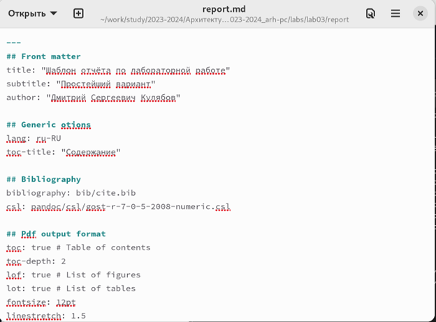

---
## Front matter
title: "Отчёт по лабораторной работе №3"
subtitle: "Дисциплина: архитектура компьютеров"
author: "Симонова Виктория Игоревна"

## Generic otions
lang: ru-RU
toc-title: "Содержание"

## Bibliography
bibliography: bib/cite.bib
csl: pandoc/csl/gost-r-7-0-5-2008-numeric.csl

## Pdf output format
toc: true # Table of contents
toc-depth: 2
lof: true # List of figures
lot: true # List of tables
fontsize: 12pt
linestretch: 1.5
papersize: a4
documentclass: scrreprt
## I18n polyglossia
polyglossia-lang:
  name: russian
  options:
	- spelling=modern
	- babelshorthands=true
polyglossia-otherlangs:
  name: english
## I18n babel
babel-lang: russian
babel-otherlangs: english
## Fonts
mainfont: PT Serif
romanfont: PT Serif
sansfont: PT Sans
monofont: PT Mono
mainfontoptions: Ligatures=TeX
romanfontoptions: Ligatures=TeX
sansfontoptions: Ligatures=TeX,Scale=MatchLowercase
monofontoptions: Scale=MatchLowercase,Scale=0.9
## Biblatex
biblatex: true
biblio-style: "gost-numeric"
biblatexoptions:
  - parentracker=true
  - backend=biber
  - hyperref=auto
  - language=auto
  - autolang=other*
  - citestyle=gost-numeric
## Pandoc-crossref LaTeX customization
figureTitle: "Рис."
tableTitle: "Таблица"
listingTitle: "Листинг"
lofTitle: "Список иллюстраций"
lolTitle: "Листинги"
## Misc options
indent: true
header-includes:
  - \usepackage{indentfirst}
  - \usepackage{float} # keep figures where there are in the text
  - \floatplacement{figure}{H} # keep figures where there are in the text
---

# Цель работы

Целью данной лабораторной работы является освоение процедуры оформления отчетов с помощью легковесного языка разметки Markdown.

# Задание

1. В соответствующем каталоге сделайте отчёт по лабораторной работе № 2 в формате
Markdown. В качестве отчёта необходимо предоставить отчёты в 3 форматах: pdf, docx
и md.
2. Загрузите файлы на github.
# Теоретическое введение
Markdown — облегчённый язык разметки, созданный с целью обозначения форматирования в простом тексте, с максимальным сохранением его читаемости человеком, и пригодный для машинного преобразования в языки для продвинутых публикаций.
# Выполнение лабораторной работы
## Установление необходимого ПО
### Установка TexLive
Устанавливаю TexLive из командной строки (рис. [-@fig:001])

{ #fig:001 width=70% }

Проверяю выполнение установки TexLive(рис. [-@fig:002])

{ #fig:002 width=70% }

### Установка pandoc

Устанавливаю pandoc из командной строки (рис. [-@fig:003])

{ #fig:003 width=70% }

Проверяю выполнение установки pandoc (рис. [-@fig:004])

{ #fig:004 width=70% }

## Заполнение отчета по выполнению лабораторной работы №3 с помощью языка разметки Markdown

Открываю терминал и перехожу в каталог предмета.Ввожу команду "git pull" , извлкекаю и загружаю содержимое из удалённого репозитория, обновляю локальный репозиторий с этим содержимым. (рис. [-@fig:005])

{ #fig:005 width=70% }

Перехожу в каталог с шаблоном отчета по лабораторной работе №3 с помощью cd. Компилирую шаблон с использованием Makefile, вводя команду make (рис. [-@fig:006])

{ #fig:006 width=70% }

Открываю сгенерированный файл шаблона report.docx в LibreOffice (рис. [-@fig:007])

{ #fig:007 width=70% }

Открываю сгенерированный файл шаблона report.pdf в Текстовом редакторе (рис. [-@fig:008])

{ #fig:008 width=70% }

Удаляю шаблоны файлов, используя makerfile. Ввожу команду "make file". Проверяю, что созданные файлы удалились, для этого ввожу команду "ls" (рис. [-@fig:009])

{ #fig:009 width=70% }

Открываю файл report.md с помощью Текстового редактора (рис. [-@fig:010])

{ #fig:010 width=70% }

Копирую шаблон отчёта с помощью утилиты "cp" (рис. [-@fig:011])

{ #fig:011 width=70% }

В скопированном файле заполняю отчёт, используя язык разметки Markdown. (рис. [-@fig:012])

{ #fig:012 width=70% }

Компилирую файл с отчетом. Загружаю отчет на GitHub.

## Задание для самостоятельной работы

С помощью команды "cd" перехожу в директорию с файлом отчёта по второй лаборпторной работе. (рис. [-@fig:013])

{ #fig:013 width=70% }

Удаляю фал предыдущего отчёта, чтобы он не мешал при последующей компиляции. (рис. [-@fig:014])

{ #fig:014 width=70% }

Копирую файл report.md для для последующего заполнения отчёта (рис. [-@fig:015])

{ #fig:015 width=70% }

Открываю скопированный файл с помощью Текстового редактора и заполняю отчёта. (рис. [-@fig:016])

{ #fig:016 width=70% }

Компилирую файл с отчетом по лабораторной работе (рис. [-@fig:017])

{ #fig:017 width=70% }

 Удаляю лишние сгенерированные файлы report.docx и report.pdf (рис. [-@fig:018])

{ #fig:018 width=70% }

Проверка выполнения команды "rm" (рис. [-@fig:019])

{ #fig:019 width=70% }

Добавляю изменения на GitHub с помощью комнадой git add и сохраняю изменения с помощью commit. (рис. [-@fig:020])

{ #fig:020 width=70% }

Отправлялю файлы на сервер с помощью команды git pull. (рис. [-@fig:021])

{ #fig:021 width=70% }

 

# Выводы

В ходе выполнения данной лабораторной работы, я получила навыки составления отчётов с помощью языка разметки Markdown.

# Список литературы{.unnumbered}

::: {#refs}
:::
1. [Архитектура ЭВМ](https://esystem.rudn.ru/pluginfile.php/1584625/mod_resource/content/1/%D0%9B%D0%B0%D0%B1%D0%BE%D1%80%D0%B0%D1%82%D0%BE%D1%80%D0%BD%D0%B0%D1%8F%20%D1%80%D0%B0%D0%B1%D0%BE%D1%82%D0%B0%20%E2%84%964.pdf)
