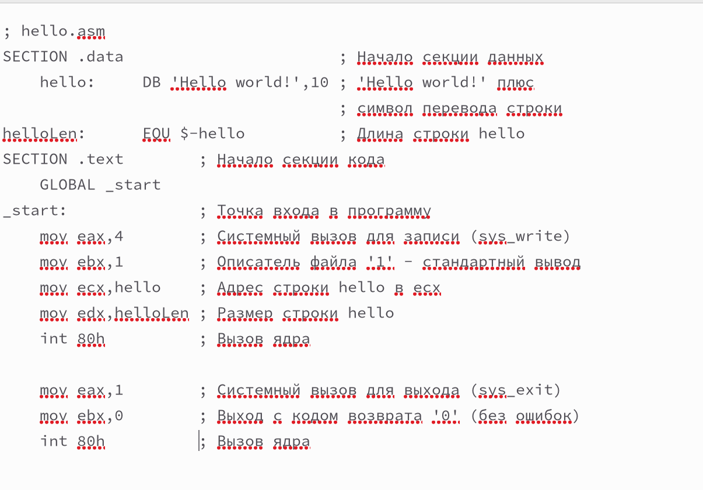
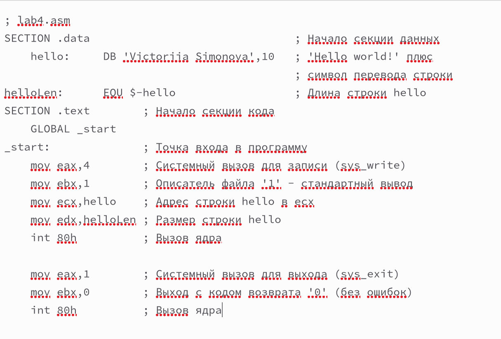

---
## Front matter
title: "Отчёт по лабораторной работе №4"
subtitle: "Дисциплина: архитектура компьютеров"
author: "Симонова Виктория Игоревна"

## Generic otions
lang: ru-RU
toc-title: "Содержание"

## Bibliography
bibliography: bib/cite.bib
csl: pandoc/csl/gost-r-7-0-5-2008-numeric.csl

## Pdf output format
toc: true # Table of contents
toc-depth: 2
lof: true # List of figures
lot: true # List of tables
fontsize: 12pt
linestretch: 1.5
papersize: a4
documentclass: scrreprt
## I18n polyglossia
polyglossia-lang:
  name: russian
  options:
	- spelling=modern
	- babelshorthands=true
polyglossia-otherlangs:
  name: english
## I18n babel
babel-lang: russian
babel-otherlangs: english
## Fonts
mainfont: PT Serif
romanfont: PT Serif
sansfont: PT Sans
monofont: PT Mono
mainfontoptions: Ligatures=TeX
romanfontoptions: Ligatures=TeX
sansfontoptions: Ligatures=TeX,Scale=MatchLowercase
monofontoptions: Scale=MatchLowercase,Scale=0.9
## Biblatex
biblatex: true
biblio-style: "gost-numeric"
biblatexoptions:
  - parentracker=true
  - backend=biber
  - hyperref=auto
  - language=auto
  - autolang=other*
  - citestyle=gost-numeric
## Pandoc-crossref LaTeX customization
figureTitle: "Рис."
tableTitle: "Таблица"
listingTitle: "Листинг"
lofTitle: "Список иллюстраций"
lotTitle: "Список таблиц"
lolTitle: "Листинги"
## Misc options
indent: true
header-includes:
  - \usepackage{indentfirst}
  - \usepackage{float} # keep figures where there are in the text
  - \floatplacement{figure}{H} # keep figures where there are in the text
---

# Цель работы

# Задание

Здесь приводится описание задания в соответствии с рекомендациями
методического пособия и выданным вариантом.

# Теоретическое введение

Основными функциональными элементами любой электронно-вычислительной машины
(ЭВМ) являются центральный процессор, память и периферийные устройства (рис. 4.1).
Взаимодействие этих устройств осуществляется через общую шину, к которой они подключены. Физически шина представляет собой большое количество проводников, соединяющих
устройства друг с другом. В современных компьютерах проводники выполнены в виде электропроводящих дорожек на материнской (системной) плате.
Основной задачей процессора является обработка информации, а также организация
координации всех узлов компьютера. В состав центрального процессора (ЦП) входят
следующие устройства:
• арифметико-логическое устройство (АЛУ) — выполняет логические и арифметические действия, необходимые для обработки информации, хранящейся в памяти;
• устройство управления (УУ) — обеспечивает управление и контроль всех устройств
компьютера;
• регистры — сверхбыстрая оперативная память небольшого объёма, входящая в состав процессора, для временного хранения промежуточных результатов выполнения
инструкций; регистры процессора делятся на два типа: регистры общего назначения и
специальные регистры.
Для того, чтобы писать программы на ассемблере, необходимо знать, какие регистры
процессора существуют и как их можно использовать. Большинство команд в программах
написанных на ассемблере используют регистры в качестве операндов. Практически все
команды представляют собой преобразование данных хранящихся в регистрах процессора,
это например пересылка данных между регистрами или между регистрами и памятью, преобразование (арифметические или логические операции) данных хранящихся в регистрах.
Доступ к регистрам осуществляется не по адресам, как к основной памяти, а по именам.
Каждый регистр процессора архитектуры x86 имеет свое название, состоящее из 2 или 3
букв латинского алфавита.
В качестве примера приведем названия основных регистров общего назначения (именно
эти регистры чаще всего используются при написании программ):
• RAX, RCX, RDX, RBX, RSI, RDI — 64-битные
• EAX, ECX, EDX, EBX, ESI, EDI — 32-битные
• AX, CX, DX, BX, SI, DI — 16-битные
• AH, AL, CH, CL, DH, DL, BH, BL — 8-битные (половинки 16-битных регистров). Например,
AH (high AX) — старшие 8 бит регистра AX, AL (low AX) — младшие 8 бит регистра AX.
Таким образом можно отметить, что вы можете написать в своей программе, например,
такие команды (mov – команда пересылки данных на языке ассемблера):
mov ax, 1
mov eax, 1
Обе команды поместят в регистр AX число 1. Разница будет заключаться только в том, что
вторая команда обнулит старшие разряды регистра EAX, то есть после выполнения второй
команды в регистре EAX будет число 1.А первая команда оставит в старших разрядах регистра
EAX старые данные. И если там были данные, отличные от нуля, то после выполнения первой
команды в регистре EAX будет какое-то число, но не 1. А вот в регистре AX будет число 1.
Другим важным узлом ЭВМ является оперативное запоминающее устройство (ОЗУ).
ОЗУ — это быстродействующее энергозависимое запоминающее устройство, которое напрямую взаимодействует с узлами процессора, предназначенное для хранения программ и
данных, с которыми процессор непосредственно работает в текущий момент. ОЗУ состоит из
одинаковых пронумерованных ячеек памяти. Номер ячейки памяти — это адрес хранящихся
в ней данных.
В состав ЭВМ также входят периферийные устройства, которые можно разделить на:
• устройства внешней памяти, которые предназначены для долговременного хранения больших объёмов данных (жёсткие диски, твердотельные накопители, магнитные
ленты);
• устройства ввода-вывода, которые обеспечивают взаимодействие ЦП с внешней
средой.
В основе вычислительного процесса ЭВМ лежит принцип программного управления.
Это означает, что компьютер решает поставленную задачу как последовательность действий,
записанных в виде программы. Программа состоит из машинных команд, которые указывают, какие операции и над какими данными (или операндами), в какой последовательности
необходимо выполнить.
Набор машинных команд определяется устройством конкретного процессора. Коды команд представляют собой многоразрядные двоичные комбинации из 0 и 1. В коде машинной
команды можно выделить две части: операционную и адресную. В операционной части хранится код команды, которую необходимо выполнить. В адресной части хранятся данные
или адреса данных, которые участвуют в выполнении данной операции.
При выполнении каждой команды процессор выполняет определённую последовательность стандартных действий, которая называется командным циклом процессора. В
самом общем виде он заключается в следующем:
1. формирование адреса в памяти очередной команды;
2. считывание кода команды из памяти и её дешифрация;
3. выполнение команды;
4. переход к следующей команде.
Данный алгоритм позволяет выполнить хранящуюся в ОЗУ программу. Кроме того, в
зависимости от команды при её выполнении могут проходить не все этапы.
Более подробно введение о теоретических основах архитектуры ЭВМ см. в [9; 11]

Язык ассемблера (assembly language, сокращённо asm) — машинно-ориентированный
язык низкого уровня. Можно считать, что он больше любых других языков приближен к
архитектуре ЭВМ и её аппаратным возможностям, что позволяет получить к ним более
полный доступ, нежели в языках высокого уровня,таких как C/C++, Perl, Python и пр.
# Выполнение лабораторной работы

##  Программа Hello world!

Создание каталога для работы с программами на языке ассемблера NASM с помощью команды mkdir и проверка выполнения команды.  (рис. [-@fig:001]).

{ #fig:001 width=70% }

Перехожу в директорию ~/work/arch-pc и создайю текстовый файл с именем hello.asm (рис. [-@fig:002]).

{ #fig:002 width=70% }

Открываю созданный файл с помощью текстового редактора и ввожу текст (рис. [-@fig:003]).

{ #fig:003 width=70% }

## Транслятор NASM

Превращаю текст программы для вывода "Hello world!" в объектный код с помощью транслятора NASM, используя команду nasm -f elf hello.asm, ключ -f указывает транслятору nasm, что требуется создать бинарный файл в формате ELF. (рис. [-@fig:004]).

{ #fig:004 width=70% }

## Расширенный синтаксис командной строки NASM

Ввожу команду nasm -o obj.o -f elf -g -l list.lst hello.asm. Данная команда компилирует исходный файл в obj.o при этом формат выходного файла будет elf, и в него будут включены символы для отладки (опция -g), кроме того, будет создан файл листинга list.lst (опция -l). (рис. [-@fig:005]).

{ #fig:005 width=70% }

## Компоновщик LD

Передаю объектный файл на обработку компановщику LD, получаю исполняемый файл hello(рис. [-@fig:006]).

{ #fig:006 width=70% }

Выполняю команду ld -m elf_i386 obj.o -o main Исполняемый файл будет иметь имя main, т.к. после ключа -о было задано значение main. Объектный файл имеет имя obj.o. (рис. [-@fig:007]).

{ #fig:007 width=70% }

## Запуск исполняемого файла

Запускаю на выполнение созданный исполняемый файл, находящийся в текущем каталоге . На экран выводятся Hello word! (рис. [-@fig:008]).

{ #fig:008 width=70% }r
# Задание для самостоятельной работы

Перехожу в каталог ~/work/arch-pc/lab04, создаю копию файла hello.asm c именем lab4.asm с помощью команды cp. (рис. [-@fig:009]).

{ #fig:009 width=70% }

С помощью текстового редактора открываю файл lab4.asm и вношу изменения в программу так, чтобы она выводила мои имя и фамилию.(рис. [-@fig:010]).

{ #fig:010 width=70% }

Компилирую текст программы в объектный файл, передаю на обработку компановщику. Полученный исполняемый файл запускаю. На экран выводятся мои имя и фамилия.(рис. [-@fig:011]).

{ #fig:011 width=70% }

Копирую файлы hello.asm и lab4.asm в локальный репозиторий в каталог ~/work/study/2023-2024/"Архитектура компьютера"/study_2023-2024_arh-pc/labs/lab04 (рис. [-@fig:012]).

{ #fig:012 width=70% }

Добавляю файлы на Github (рис. [-@fig:013]).

{ #fig:013 width=70% }

Отправляю файлы на сервер  с помощью команды git push (рис. [-@fig:014]).

{ #fig:014 width=70% } 

# Выводы

Я освоила процедуры компиляции и сборки программ, наптсанных на ассемьлере NASM.

# Список литературы{.unnumbered}

::: {#refs}
:::
1. https://esystem.rudn.ru/pluginfile.php/1584628/mod_resource/content/1/%D0%9B%D0%B0%D0%B1%D0%BE%D1%80%D0%B0%D1%82%D0%BE%D1%80%D0%BD%D0%B0%D1%8F%20%D1%80%D0%B0%D0%B1%D0%BE%D1%82%D0%B0%20%E2%84%965.pdf
