---
## Front matter
title: "Отчёт по лабораторной работе №55"
subtitle: "Дисциплина: архитектура компьютеров"
author: "Симонова Виктория Игоревна"

## Generic otions
lang: ru-RU
toc-title: "Содержание"

## Bibliography
bibliography: bib/cite.bib
csl: pandoc/csl/gost-r-7-0-5-2008-numeric.csl

## Pdf output format
toc: true # Table of contents
toc-depth: 2
lof: true # List of figures
lot: true # List of tables
fontsize: 12pt
linestretch: 1.5
papersize: a4
documentclass: scrreprt
## I18n polyglossia
polyglossia-lang:
  name: russian
  options:
	- spelling=modern
	- babelshorthands=true
polyglossia-otherlangs:
  name: english
## I18n babel
babel-lang: russian
babel-otherlangs: english
## Fonts
mainfont: PT Serif
romanfont: PT Serif
sansfont: PT Sans
monofont: PT Mono
mainfontoptions: Ligatures=TeX
romanfontoptions: Ligatures=TeX
sansfontoptions: Ligatures=TeX,Scale=MatchLowercase
monofontoptions: Scale=MatchLowercase,Scale=0.9
## Biblatex
biblatex: true
biblio-style: "gost-numeric"
biblatexoptions:
  - parentracker=true
  - backend=biber
  - hyperref=auto
  - language=auto
  - autolang=other*
  - citestyle=gost-numeric
## Pandoc-crossref LaTeX customization
figureTitle: "Рис."
tableTitle: "Таблица"
listingTitle: "Листинг"
lofTitle: "Список иллюстраций"
lotTitle: "Список таблиц"
lolTitle: "Листинги"
## Misc options
indent: true
header-includes:
  - \usepackage{indentfirst}
  - \usepackage{float} # keep figures where there are in the text
  - \floatplacement{figure}{H} # keep figures where there are in the text
---

# Цель работы

Приобретение практических навыков работы в Midnight Commander. Освоение инструкций
языка ассемблера mov и int.

# Задание

1. Основы работы с mc
2. Структура программы на языке ассемблера NASM
3. Подключение внешнего файла
4. Выполнение заданий для самостоятельной работы

# Теоретическое введение

Midnight Commander (или просто mc) — это программа, которая позволяет просматривать структуру каталогов и выполнять основные операции по управлению файловой системой, т.е. mc является файловым менеджером. Midnight Commander позволяет сделать работу с файлами более удобной и наглядной.
Программа на языке ассемблера NASM, как правило, состоит из трёх секций: секция кода программы (SECTION .text), секция инициированных (известных во время компиляции) данных (SECTION .data) и секция неинициализированных данных (тех, под которые во время компиляции только отводится память, а значение присваивается в ходе выполнения программы) (SECTION .bss).
Для объявления инициированных данных в секции .data используются директивы DB, DW, DD, DQ и DT, которые резервируют память и указывают, какие значения должны храниться в этой памяти:
- DB (define byte) — определяет переменную размером в 1 байт;
- DW (define word) — определяет переменную размеров в 2 байта (слово);
- DD (define double word) — определяет переменную размером в 4 байта (двойное слово);
- DQ (define quad word) — определяет переменную размером в 8 байт (учетве-
рённое слово);
- DT (define ten bytes) — определяет переменную размером в 10 байт. Директивы используются для объявления простых переменных и для объявления массивов. Для определения строк принято использовать директиву DB в связи с особенностями хранения данных в оперативной памяти.
Инструкция языка ассемблера mov предназначена для дублирования данных источника в приёмнике. 
```NASM
mov dst,src
```
Здесь операнд dst — приёмник, а src — источник.
В качестве операнда могут выступать регистры (register), ячейки памяти (memory) и непосредственные значения (const).
Инструкция языка ассемблера intпредназначена для вызова прерывания с
указанным номером. 
```NASM
int n
```
Здесь n — номер прерывания, принадлежащий диапазону 0–255. При программировании в Linux с использованием вызовов ядра sys_calls n=80h (принято задавать в шестнадцатеричной системе счисления).


# Выполнение лабораторной работы
##Работа с Midnight Commander
Открываю Midnight Commander, введя в терминал mc (рис. [-@fig:001]).

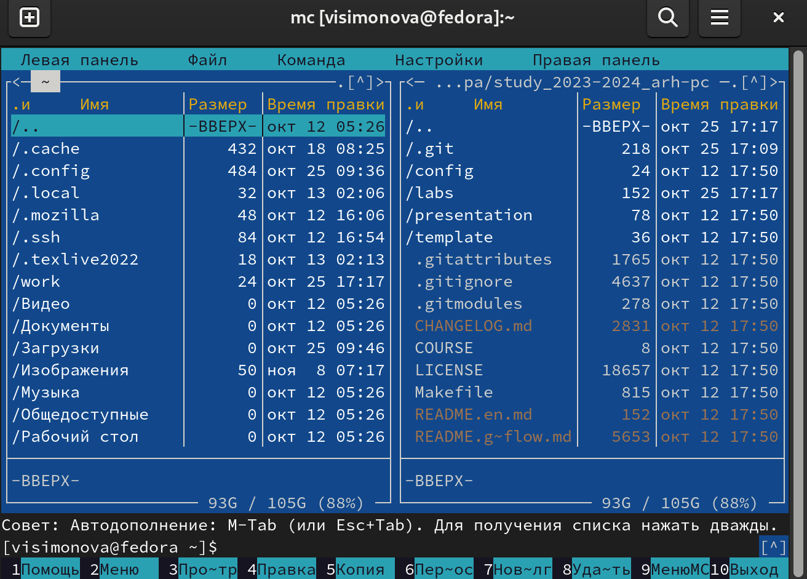{ #fig:001 width=70% }

Создаю папку lab05 в каталоге ~/work/arch-pc (рис. [-@fig:002]).

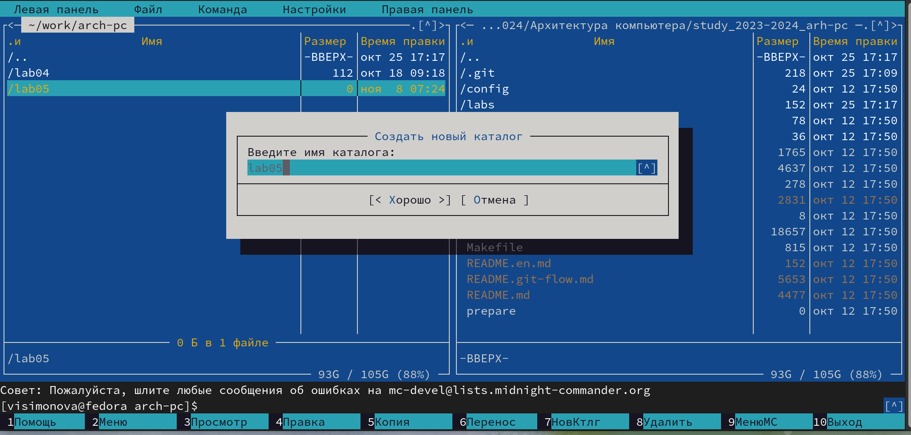{ #fig:002 width=70% }

Перехожу в созданный каталог и с помощью команды touch  файл  lab5-1.asm (рис. [-@fig:003]).

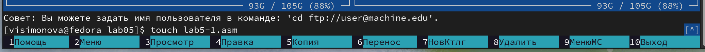{ #fig:003 width=70% }

Открываю файл lab5-1.asm для редактирования и ввожу текст программы и ввожу текстпрограммы для запроса строки у пользователя (рис. [-@fig:004]).

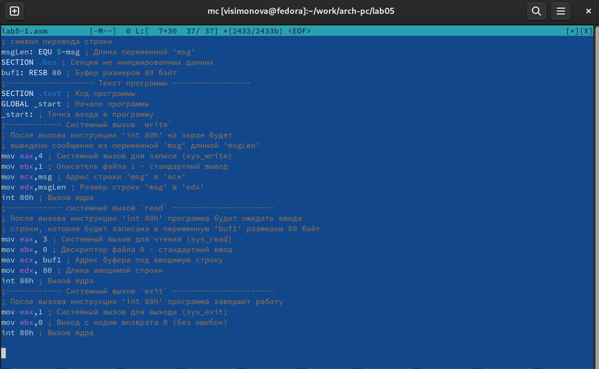{ #fig:004 width=70% }

Открываю файл lab5-1.asm для просмотра, чтобы проверить содержание текста программы в файле (рис. [-@fig:005]).

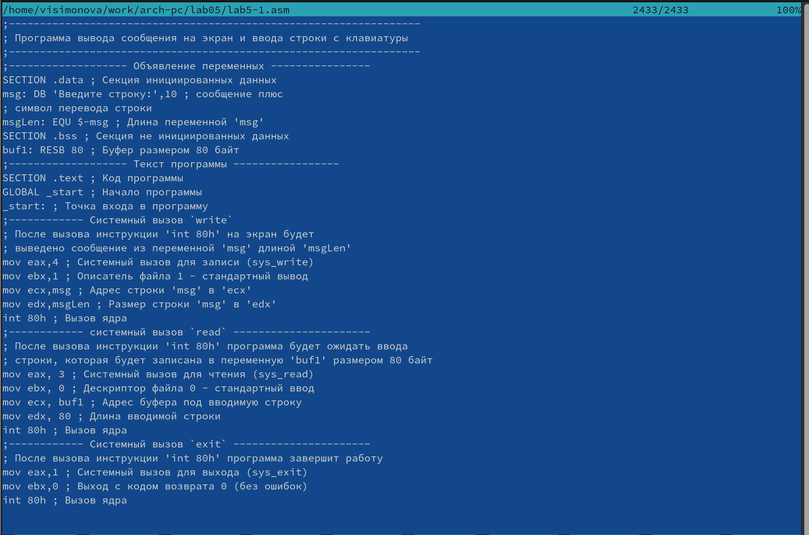{ #fig:005 width=70% }

Транслирую файл lab5-1.asm (рис. [-@fig:006]).

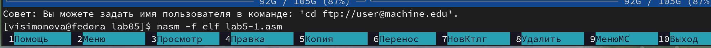{ #fig:006 width=70% }

Компаную файл lab5-1.asm (рис. [-@fig:007]).

{ #fig:007 width=70% }

Запускаю исполняемый файл и ввожу имя пользователя с клавиатуры (рис. [-@fig:008]).

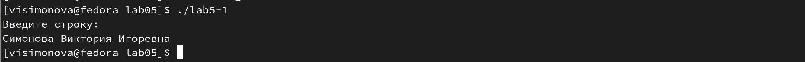{ #fig:008 width=70% }

##Подключение внешнего файла 

Скачиваю файл in_out.asm из ТУИС файл,он попадает в загрузки. Копирую его в каталог lab05, тк он должен будет имрользоваться в прогамме, которая находится в этом каталоге. (рис. [-@fig:009]).

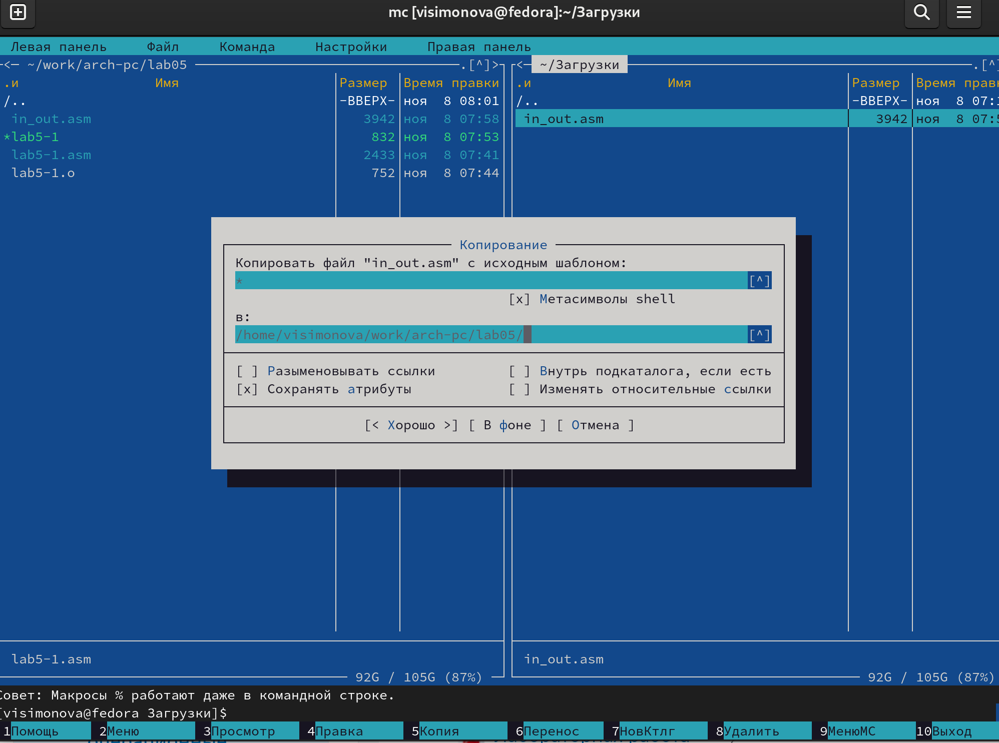{ #fig:009 width=70% }

Создаю копию файла lab5-1.asm с именем lab5-2.asm (рис. [-@fig:010]).

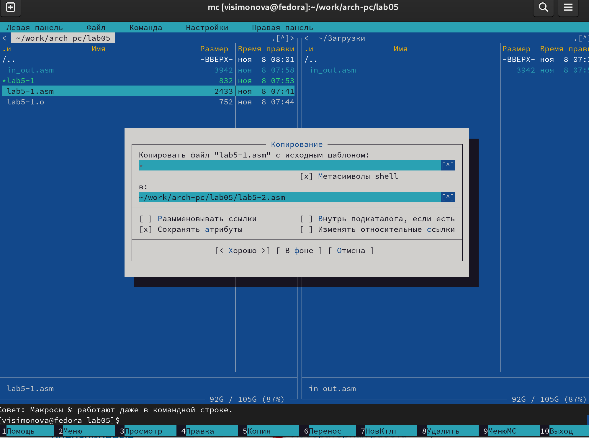{ #fig:010 width=70% }

Изменяю содержимое файла lab5-2.asm, используя подпрограмму из внешнего файла (рис. [-@fig:011]).

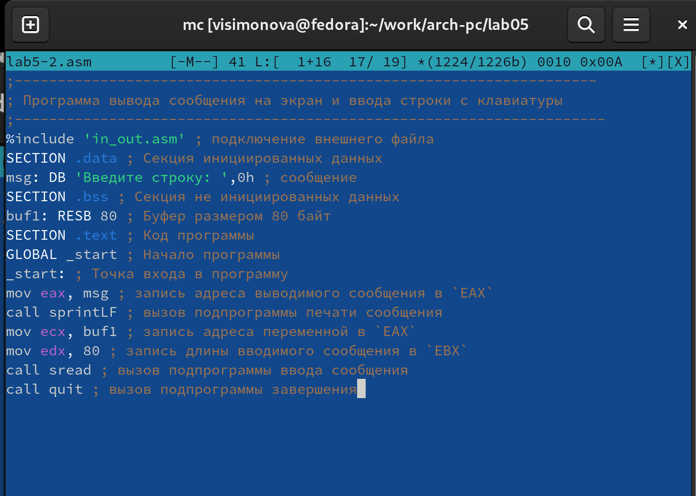{ #fig:011 width=70% }

Транслирую данный файл, затем переда. на работу компановщику и запускаю исполняемый файл, атем ввожу свои ФИО (рис. [-@fig:012]).

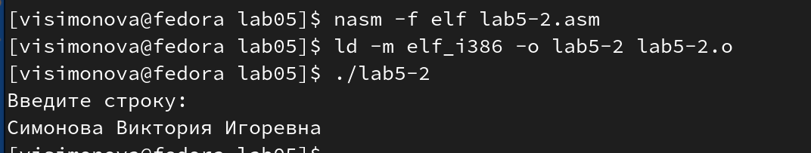{ #fig:012 width=70% }

Изменяю в файле lab5-2.asm подпрограмму sprintLF на sprint.(рис. [-@fig:013]).

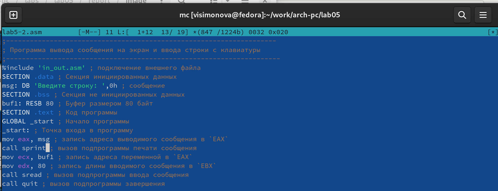{ #fig:013 width=70% }

Транслирую данный файл, затем переда. на работу компановщику и запускаю исполняемый файл,затем ввожу свои ФИО (рис. [-@fig:014]).

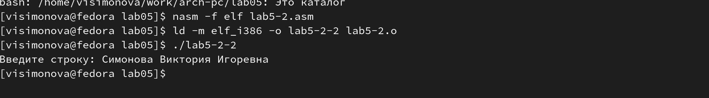{ #fig:014 width=70% }

Разница между исполняемым файлом lab5-2 и файлом lab5-2-2 в том, что запуск первого запрашивает ввод с новой строки, а программа, которая исполняется при запуске второго, запрашивает ввод без переноса на новую строку,именно в этом заключается различие между sprintLF и sprint.

## Выполнение заданий для самостоятельной работы

Создаю копию файла lab6-1.asm с именем lab6-1-1.asm (рис. [-@fig:015]).

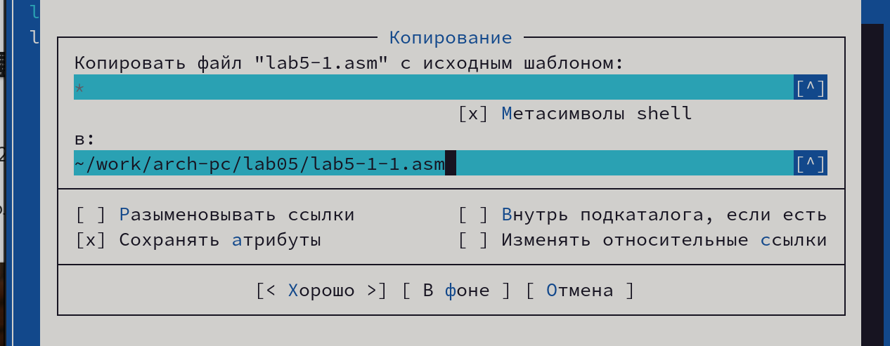{ #fig:015 width=70% }

Открываю данный файл для редактирования. Изменяю программу так, чтобы кроме вывода приглашения и запроса ввода, она выводила вводимую пользователем строку с ФИО (рис. [-@fig:016]).

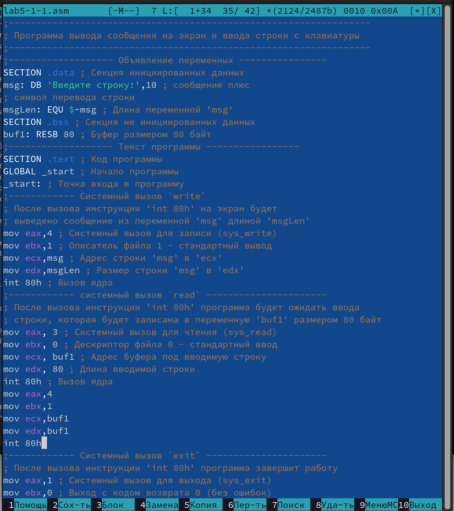{ #fig:016 width=70% }

Транслирую данный файл, затем переда. на работу компановщику (рис. [-@fig:017]).

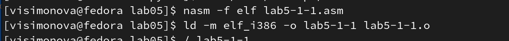{ #fig:017 width=70% }

Запускаю исполняемый файл,затем ввожу свои ФИО (рис. [-@fig:018]).

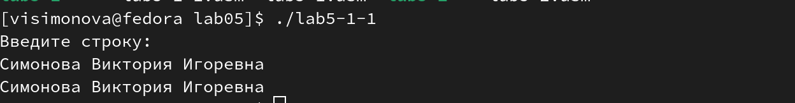{ #fig:018 width=70% }

Создаю копию файла lab5-2.asm с именем lab5-2-1.asm (рис. [-@fig:019]).

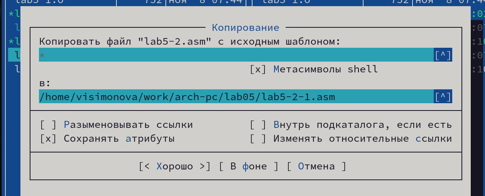{ #fig:019 width=70% }

Изменяю программу так, чтобы кроме вывода приглашения и запроса ввода, она выводила вводимую пользователем строку (рис. [-@fig:020]).

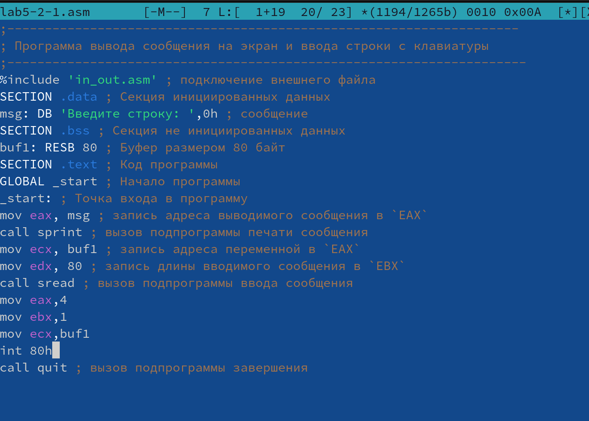{ #fig:020 width=70% }

Транслирую данный файл, затем переда. на работу компановщику и запускаю исполняемый файл,затем ввожу свои ФИО (рис. [-@fig:021]).

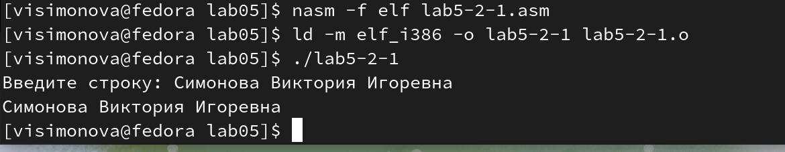{ #fig:021 width=70% }

# Выводы

При выполнении данной лабораторной работы я приобрела практические навыеи работы с Midnight Commander, освоила инструкции языка асскмблера  mov и int.

# Список литературы{.unnumbered}

::: {#refs}
:::
1. [Лабораторная работа №6](https://esystem.rudn.ru/pluginfile.php/1584633/mod_resource/content/1/%D0%9B%D0%B0%D0%B1%D0%BE%D1%80%D0%B0%D1%82%D0%BE%D1%80%D0%BD%D0%B0%D1%8F%20%D1%80%D0%B0%D0%B1%D0%BE%D1%82%D0%B0%20%E2%84%966.pdf)
