---
## Front matter
title: "Отчёт по лабораторной работе №6"
subtitle: "Дисциплина: архитектура компьютеров"
author: "Симонова Виктория Игоревна"

## Generic otions
lang: ru-RU
toc-title: "Содержание"

## Bibliography
bibliography: bib/cite.bib
csl: pandoc/csl/gost-r-7-0-5-2008-numeric.csl

## Pdf output format
toc: true # Table of contents
toc-depth: 2
lof: true # List of figures
lot: true # List of tables
fontsize: 12pt
linestretch: 1.5
papersize: a4
documentclass: scrreprt
## I18n polyglossia
polyglossia-lang:
  name: russian
  options:
	- spelling=modern
	- babelshorthands=true
polyglossia-otherlangs:
  name: english
## I18n babel
babel-lang: russian
babel-otherlangs: english
## Fonts
mainfont: PT Serif
romanfont: PT Serif
sansfont: PT Sans
monofont: PT Mono
mainfontoptions: Ligatures=TeX
romanfontoptions: Ligatures=TeX
sansfontoptions: Ligatures=TeX,Scale=MatchLowercase
monofontoptions: Scale=MatchLowercase,Scale=0.9
## Biblatex
biblatex: true
biblio-style: "gost-numeric"
biblatexoptions:
  - parentracker=true
  - backend=biber
  - hyperref=auto
  - language=auto
  - autolang=other*
  - citestyle=gost-numeric
## Pandoc-crossref LaTeX customization
figureTitle: "Рис."
tableTitle: "Таблица"
listingTitle: "Листинг"
lofTitle: "Список иллюстраций"
lotTitle: "Список таблиц"
lolTitle: "Листинги"
## Misc options
indent: true
header-includes:
  - \usepackage{indentfirst}
  - \usepackage{float} # keep figures where there are in the text
  - \floatplacement{figure}{H} # keep figures where there are in the text
---

# Цель работы

Освоение арифметических инструкций языка ассемблера NASM.

# Задание

1. Символьные и численные данные в NASM

2. Выполнение арифметических операций в NASM

3. Выполнение заданий для самостоятельной работы

# Теоретическое введение

Большинство инструкций на языке ассемблера требуют обработки операндов. Адрес операнда предоставляет место, где хранятся данные, подлежащие обработке. Это могут быть
данные хранящиеся в регистре или в ячейке памяти. Далее рассмотрены все существующие
способы задания адреса хранения операндов – способы адресации.
Существует три основных способа адресации:
• Регистровая адресация – операнды хранятся в регистрах и в команде используются
имена этих регистров, например: mov ax,bx.
• Непосредственная адресация – значение операнда задается непосредственно в команде, Например: mov ax,2.
• Адресация памяти – операнд задает адрес в памяти. В команде указывается символическое обозначение ячейки памяти, над содержимым которой требуется выполнить
операцию.
Арифметические операции в NASM.
Схема команды целочисленного сложения add (от англ. addition - добавление) выполняет
сложение двух операндов и записывает результат по адресу первого операнда. Команда add
работает как с числами со знаком, так и без знака и выглядит следующим образом:
add <операнд_1>, <операнд_2>

# Выполнение лабораторной работы
##Символьные и численные данные в NASM
Создаю каталог для программам лабораторной работы № 6 (рис. [-@fig:001]).

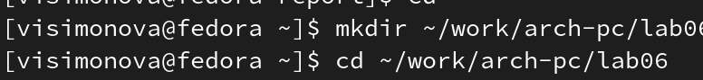{ #fig:001 width=70% }

Перейхожу в него и создаю файл lab6-1.asm (рис. [-@fig:002]).

{ #fig:002 width=70% }

Копирую в текущий каталог файл in_out.asm, тк он будет использоваться в последующих программах  (рис. [-@fig:003]).

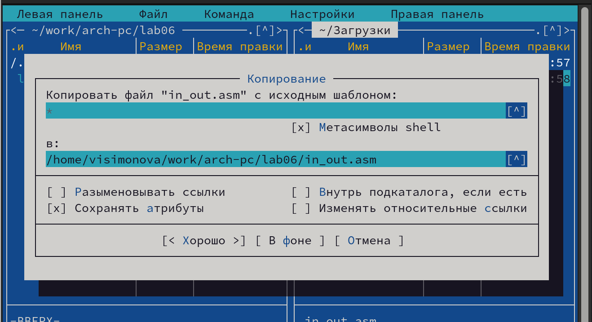{ #fig:003 width=70% }

В файл lab6-1.asm ввожу программу для вывода значений регистра eax (рис. [-@fig:004]).

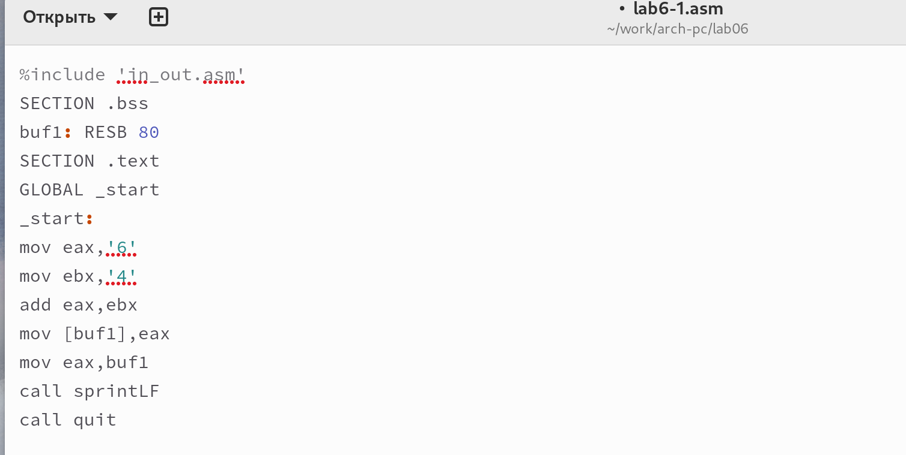{ #fig:004 width=70% }

Создаю и запускаю исполняемый файл, который выводит символ j, тк сумма двоичных кодов 4 и 6 по системе  ASCII соответствует символу j (рис. [-@fig:005]).

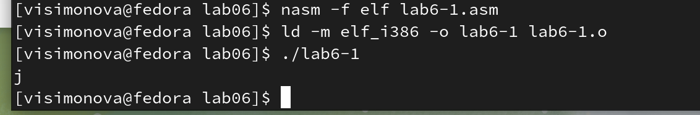{ #fig:005 width=70% }

Изменяю '6' и '4' на цифры 6 и 4 (рис. [-@fig:006]).

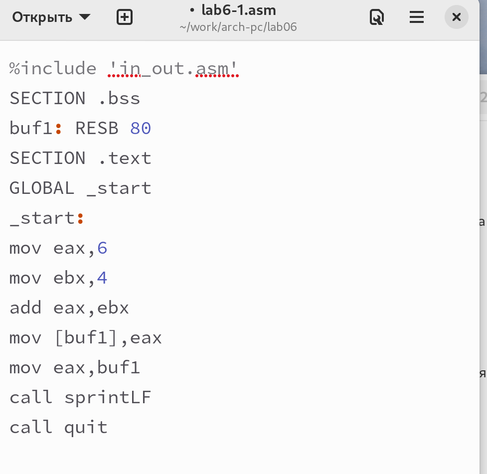{ #fig:006 width=70% }

Создаю и запускаю исполняемый файл. Теперь выводится символ с кодом 10, это символ перевода строки и он не отображается при выводе на экран (рис. [-@fig:007]).

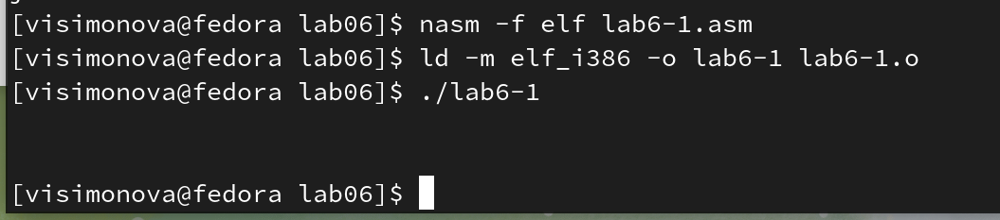{ #fig:007 width=70% }

Создаю файл lab6-2.asm в каталоге ~/work/arch-pc/lab06  (рис. [-@fig:008]).

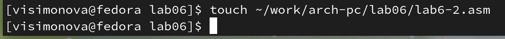{ #fig:008 width=70% }

Ввожу в него текст программы для вывода значения регистра ebx (рис. [-@fig:009]).

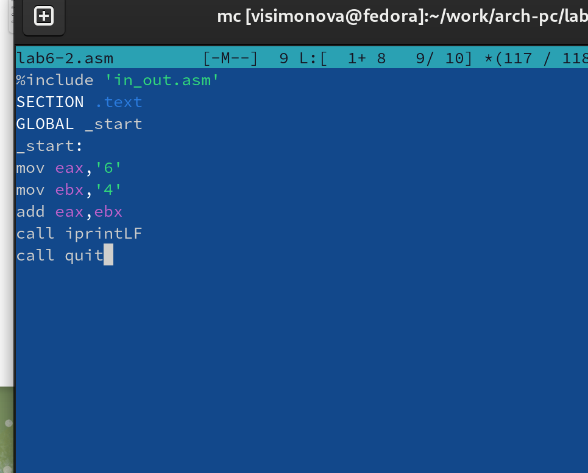{ #fig:009 width=70% } 

Создаю и запускаю исполняемый файл lab6-2, программа вывела число 106 , программа позволяет вывести именно число , а не символ, но мы всё ещё складываем коды (рис. [-@fig:010]).

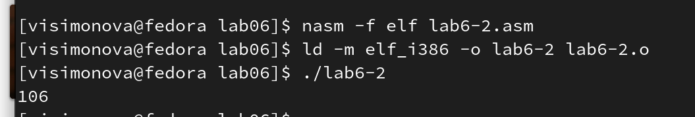{ #fig:010 width=70% }

Изменяю '6' и '4' на цифры 6 и 4 (рис. [-@fig:011]).

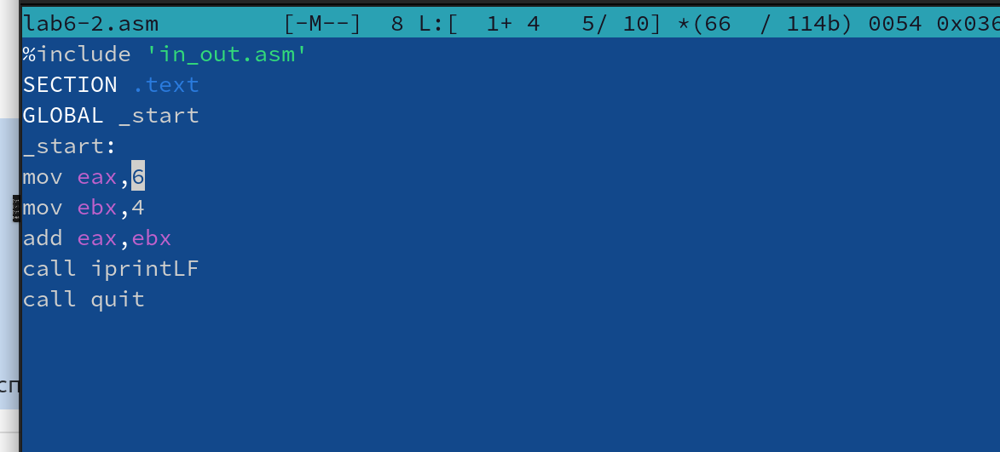{ #fig:011 width=70% }

Создаю и запускаю новый исполняемый файл lab6-2, программа вывела число 10, тк программа складывает сами числа (рис. [-@fig:012]).

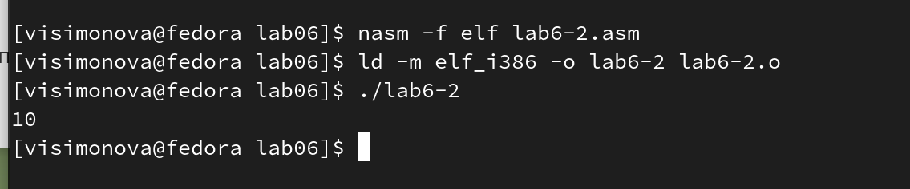{ #fig:012 width=70% }

Заменяю функцию inprintLF на inprint (рис. [-@fig:013]).

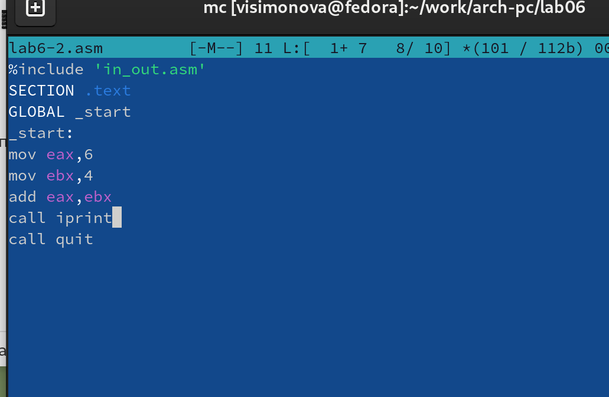{ #fig:013 width=70% }

Создаю и запускаю новый исполняемый файл lab6-2, программа вывела число 10, вывод никак не отличается, тк символ переноса строки не отображался, а сейчас его просто нет (рис. [-@fig:014]).

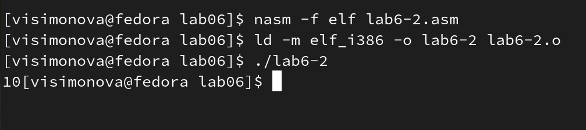{ #fig:014 width=70% }

##Выполнение арифметических операций в NASM

Создаю файл lab6-3.asm в каталоге ~/work/arch-pc/lab06 (рис. [-@fig:015]).

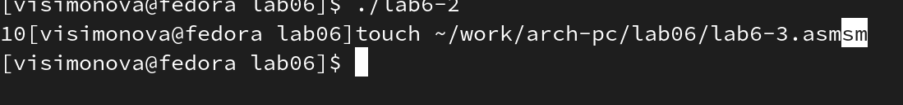{ #fig:015 width=70% }

Ввожу в файл lab6-3.asm программу вычисления выражения f(x) = (5 * 2 + 3)/3 (рис. [-@fig:016]).

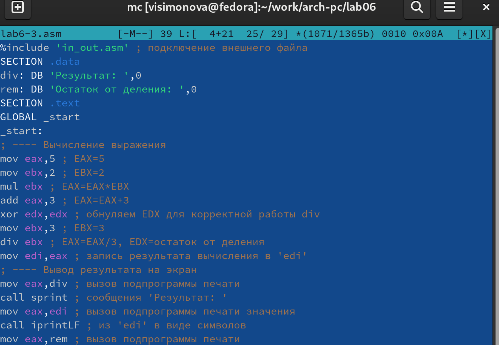{ #fig:016 width=70% }

Создаю и запускаю исполняемый файл lab6-3, программа вывела верный результат (рис. [-@fig:017]).

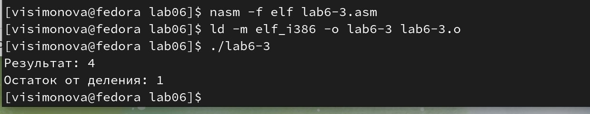{ #fig:017 width=70% }

Изменяю программу так, чтобы она высичляла значение для выражения f(x) = (4 * 6 + 2)/5 (рис. [-@fig:018]).

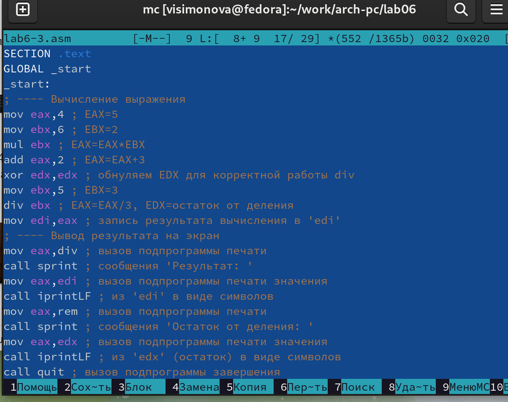{ #fig:018 width=70% }

Создаю и запускаю новый исполняемый файл lab6-3, программа вывела верный результат (рис. [-@fig:019]).

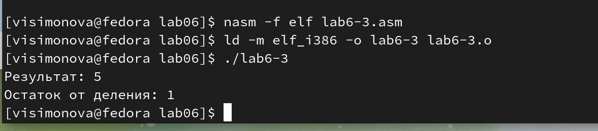{ #fig:019 width=70% }

Создаю файл variant.asm в каталоге ~/work/arch-pc/lab06 и ввожу ы него текст для вычисления варианта задания по номеру студенческого билета  (рис. [-@fig:020]).

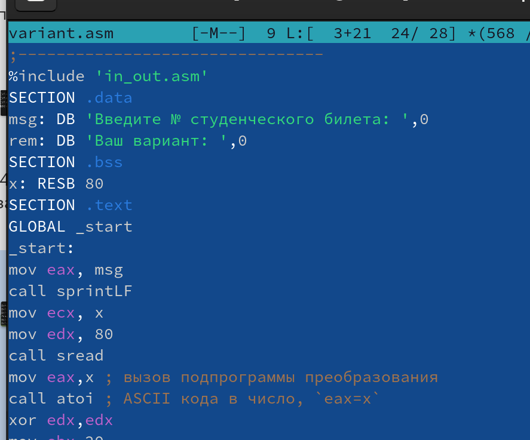{ #fig:020 width=70% }

Создаю и запускаю исполняемый файл, ввожу номер свогего студенческого билета, результат программы-14 вариант (рис. [-@fig:021]).

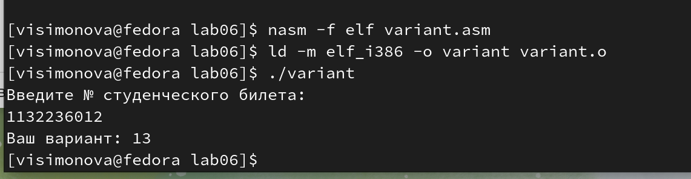{ #fig:021 width=70% }

###Ответы на вопросы

1. Какие строки листинга 6.4 отвечают за вывод на экран сообщения ‘Ваш вариант:’?

```NASM
mov eax,rem
call sprint
```

2. Для чего используется следующие инструкции?

```NASM
mov ecx, x ;кладем адрес вводимой строки в регистр ecx
mov edx, 80; запись длинны вводимой строки в регистр edx
call sread ; ввод программы из внешнего файла , вводим сообщение с клавиатуры
```

3. Для чего используется инструкция “call atoi”?

Вызов программы из внешнего файла , которая отвечает за преобразование ASCII кода.

4. Какие строки листинга 6.4 отвечают за вычисления варианта?

```NASM
xor edx,edx; обнуление регистра edx
mov ebx,20; edx=20
div ebx; edx=edx/20
inc edx;edx=edx+1
```

5. В какой регистр записывается остаток от деления при выполнении инструкции “div
ebx”?

В регистр edx

6. Для чего используется инструкция “inc edx”?

Это инкремент,команда inc ebx увеличивает значение регистра ebx на 1

7. Какие строки листинга 6.4 отвечают за вывод на экран результата вычислений?

```NASM
mov eax,edx
call iprintLF
```
## Задание для самостоятельной работы 

Создаю файл zadanie.asm и ввожу в него текст программы для вычисления выражения 13) f(x) = (8*x + 6) *10 (рис. [-@fig:022]).

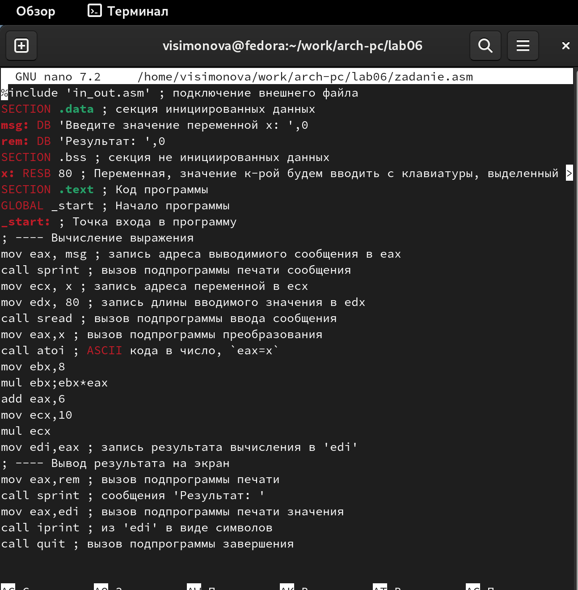{ #fig:022 width=70% }

Создаю и запускаю исполняемый файл,  ввожу первое и второе значение переменной (рис. [-@fig:023]).

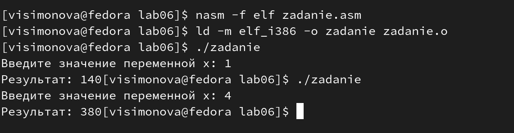{ #fig:023 width=70% } 


# Выводы

Я освоила арифметические инструкции языка ассемблера NASM.

# Список литературы{.unnumbered}

::: {#refs}
:::

1. [Лабораторная работа №7](https://esystem.rudn.ru/pluginfile.php/1584637/mod_resource/content/1/%D0%9B%D0%B0%D0%B1%D0%BE%D1%80%D0%B0%D1%82%D0%BE%D1%80%D0%BD%D0%B0%D1%8F%20%D1%80%D0%B0%D0%B1%D0%BE%D1%82%D0%B0%20%E2%84%967.pdf)
2. [Таблица ASCII](https://www.rapidtables.com/code/text/ascii-table.html)
