---
## Front matter
title: "Отчёт по лабораторной работе №7"
subtitle: "Дисциплина: архитектура компьютеров"
author: "Симонова Виктория Игоревна"

## Generic otions
lang: ru-RU
toc-title: "Содержание"

## Bibliography
bibliography: bib/cite.bib
csl: pandoc/csl/gost-r-7-0-5-2008-numeric.csl

## Pdf output format
toc: true # Table of contents
toc-depth: 2
lof: true # List of figures
lot: true # List of tables
fontsize: 12pt
linestretch: 1.5
papersize: a4
documentclass: scrreprt
## I18n polyglossia
polyglossia-lang:
  name: russian
  options:
	- spelling=modern
	- babelshorthands=true
polyglossia-otherlangs:
  name: english
## I18n babel
babel-lang: russian
babel-otherlangs: english
## Fonts
mainfont: PT Serif
romanfont: PT Serif
sansfont: PT Sans
monofont: PT Mono
mainfontoptions: Ligatures=TeX
romanfontoptions: Ligatures=TeX
sansfontoptions: Ligatures=TeX,Scale=MatchLowercase
monofontoptions: Scale=MatchLowercase,Scale=0.9
## Biblatex
biblatex: true
biblio-style: "gost-numeric"
biblatexoptions:
  - parentracker=true
  - backend=biber
  - hyperref=auto
  - language=auto
  - autolang=other*
  - citestyle=gost-numeric
## Pandoc-crossref LaTeX customization
figureTitle: "Рис."
tableTitle: "Таблица"
listingTitle: "Листинг"
lofTitle: "Список иллюстраций"
lotTitle: "Список таблиц"
lolTitle: "Листинги"
## Misc options
indent: true
header-includes:
  - \usepackage{indentfirst}
  - \usepackage{float} # keep figures where there are in the text
  - \floatplacement{figure}{H} # keep figures where there are in the text
---

# Цель работы

Изучение команд условного и безусловного переходов. Приобретение навыков написания
программ с использованием переходов. Знакомство с назначением и структурой файла
листинга.

# Задание

1. Реализация переходов в NASM.
2. Изучение структуры файла листинга.
3. Задание для самостоятельной работы.

# Теоретическое введение

Для реализации ветвлений в ассемблере используются так называемые команды передачи
управления или команды перехода. Можно выделить 2 типа переходов:
• условный переход – выполнение или не выполнение перехода в определенную точку
программы в зависимости от проверки условия.
• безусловный переход – выполнение передачи управления в определенную точку программы без каких-либо условий.

-Команды безусловного перехода
Безусловный переход выполняется инструкцией jmp (от англ. jump – прыжок), которая
включает в себя адрес перехода, куда следует передать управление:
jmp <адрес_перехода>
Адрес перехода может быть либо меткой, либо адресом области памяти, в которую предварительно помещен указатель перехода. Кроме того, в качестве операнда можно использовать
имя регистра, в таком случае переход будет осуществляться по адресу, хранящемуся в этом
регистре.
-Команды условного перехода
Как отмечалось выше, для условного перехода необходима проверка какого-либо условия.
В ассемблере команды условного перехода вычисляют условие перехода анализируя флаги
из регистра флагов.

# Выполнение лабораторной работы
## Реализация переходов в NASM

Создаю каталог lab07.asm для файлов лабораторной работы и файл lab7-1(рис. [-@fig:001]).

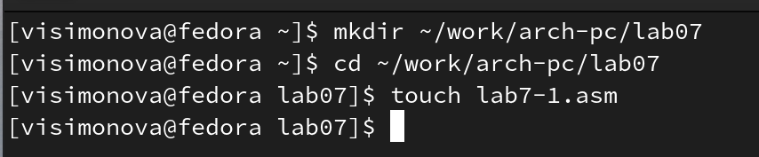{ #fig:001 width=70% }

Ввожу в файл  lab7-1.asm пример программы с импользованием инструкции jmp (рис. [-@fig:002]).

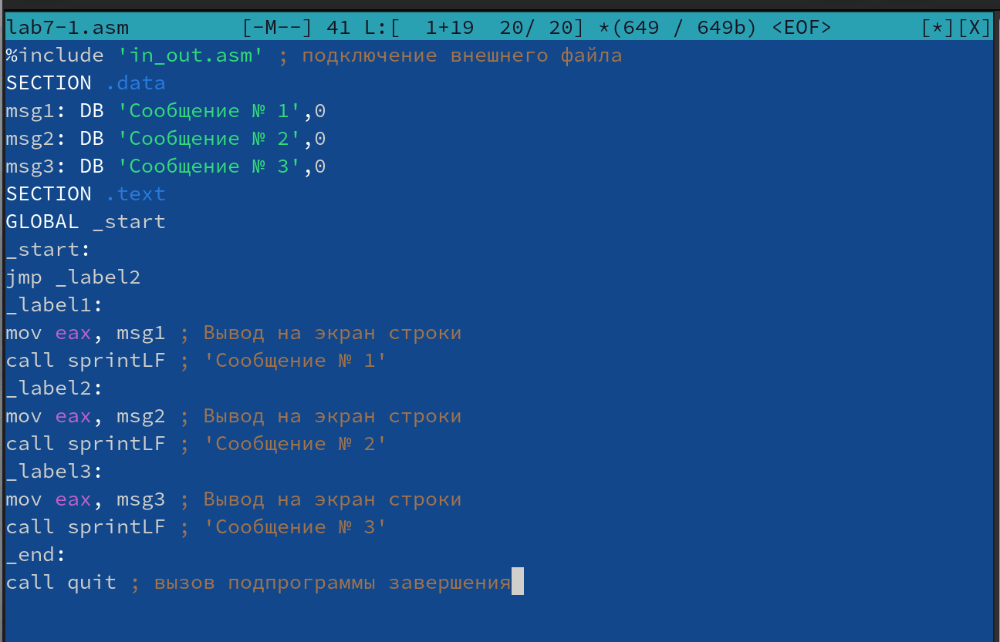{ #fig:002 width=70% }

Создаю и запускаю исполняемый файл (рис. [-@fig:003]).

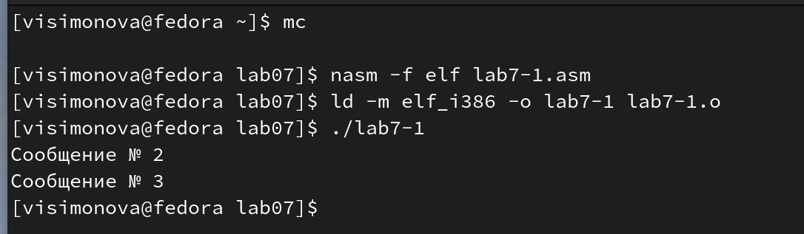{ #fig:003 width=70% }

Таким образом, использование инструкции jmp _label2 меняет порядок исполнения инструкций и позволяет выполнить инструкции начиная с метки _label2, пропустив вывод первого сообщения. (рис. [-@fig:004]).

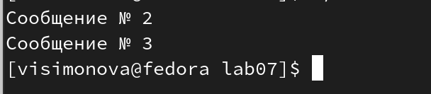{ #fig:004 width=70% }

Программа выводит Сообщение № 2 ,Сообщение № 3 .Изменяю файл так,чтобы программа выводила выводила а сначала ‘Сообщение № 2’, потом ‘Сообщение № 1’ и завершала работу.(рис. [-@fig:005]).

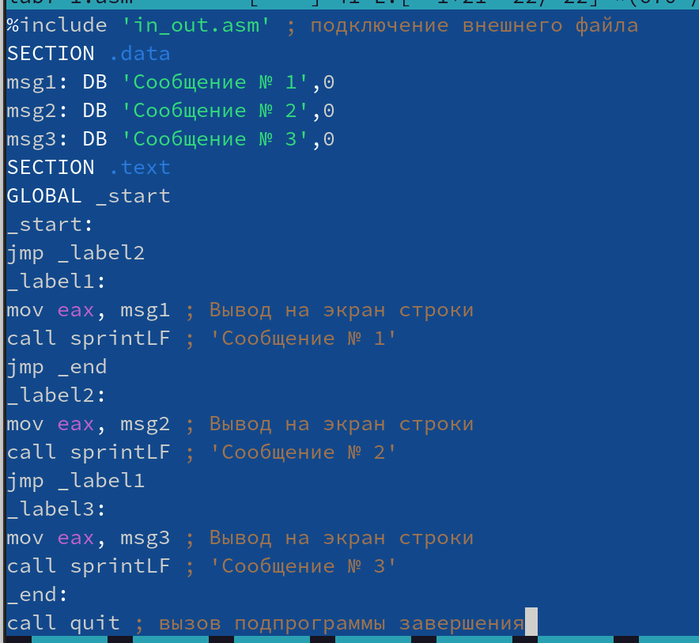{ #fig:005 width=70% }

Создаю и запускаю исполняемый файл (рис. [-@fig:006]).

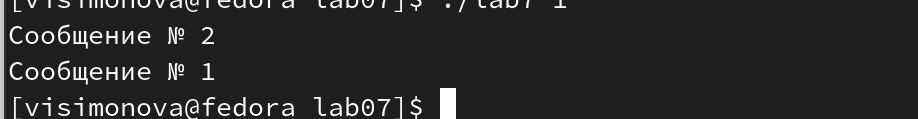{ #fig:006 width=70% }

Программа выводит Сообщение № 2 ,Сообщение № 1 .Изменяю файл так,чтобы программа выводила выводила а сначала ‘Сообщение № 3’, потом  ‘Сообщение № 2’, ‘Сообщение № 1’ и завершала работу.(рис. [-@fig:007]).

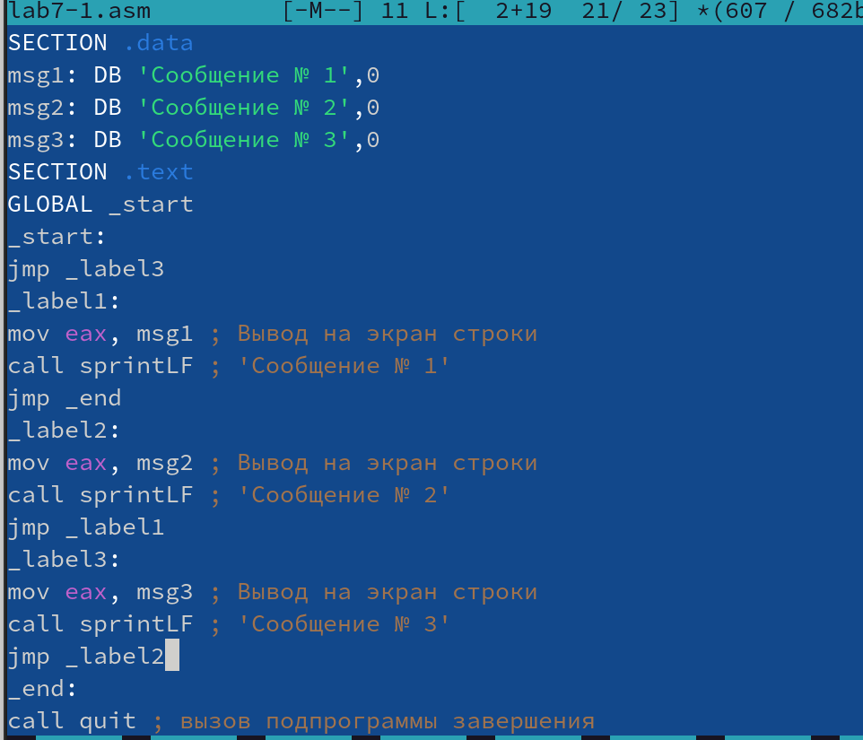{ #fig:007 width=70% }

Создаю и запускаю исполняемый файл (рис. [-@fig:008]).

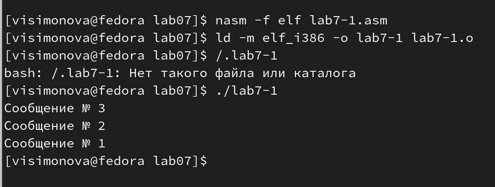{ #fig:008 width=70% }

Создаю файл lab7-2.asm  (рис. [-@fig:009]).

{ #fig:009 width=70% }

Ввожу в него код из листинга для вывода наибольшей целочисленной переменной (рис. [-@fig:010]).

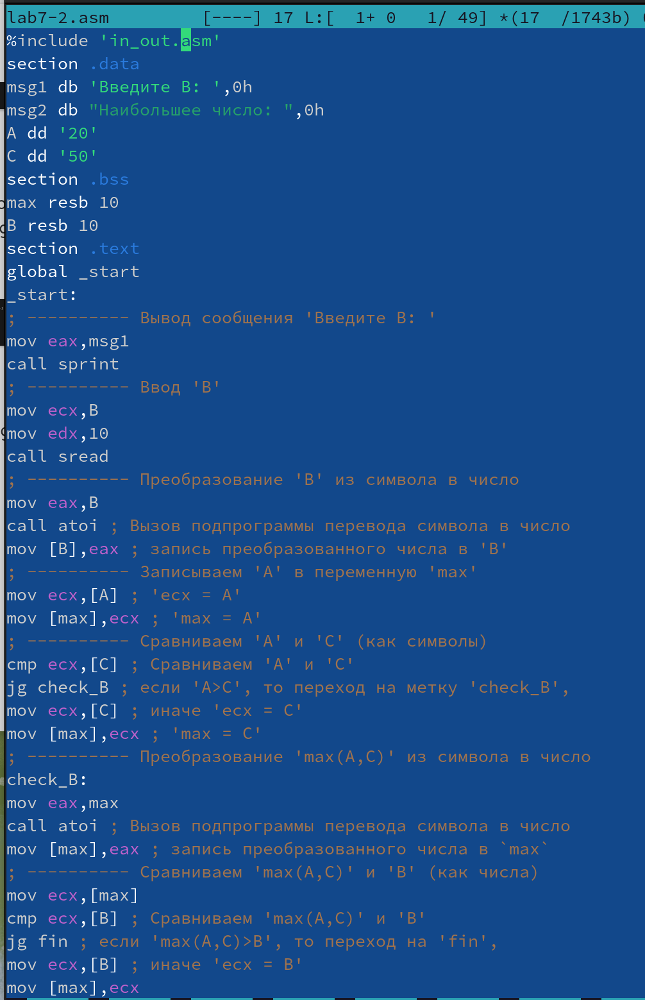{ #fig:010 width=70% }

Создаю и запускаю исполняемый файл (рис. [-@fig:011]).

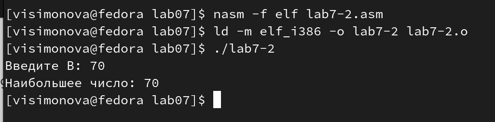{ #fig:011 width=70% }

## Изучение структуры файла листинга

Создайю файл листинга для программы из файла lab7-2.asm с помощью команды "nasm -f elf -l lab7-2.lst lab7-2.asm" (рис. [-@fig:012]).

{ #fig:012 width=70% }

Откройте файл листинга lab7-2.lst с помощью текстового редактора (рис. [-@fig:013]).

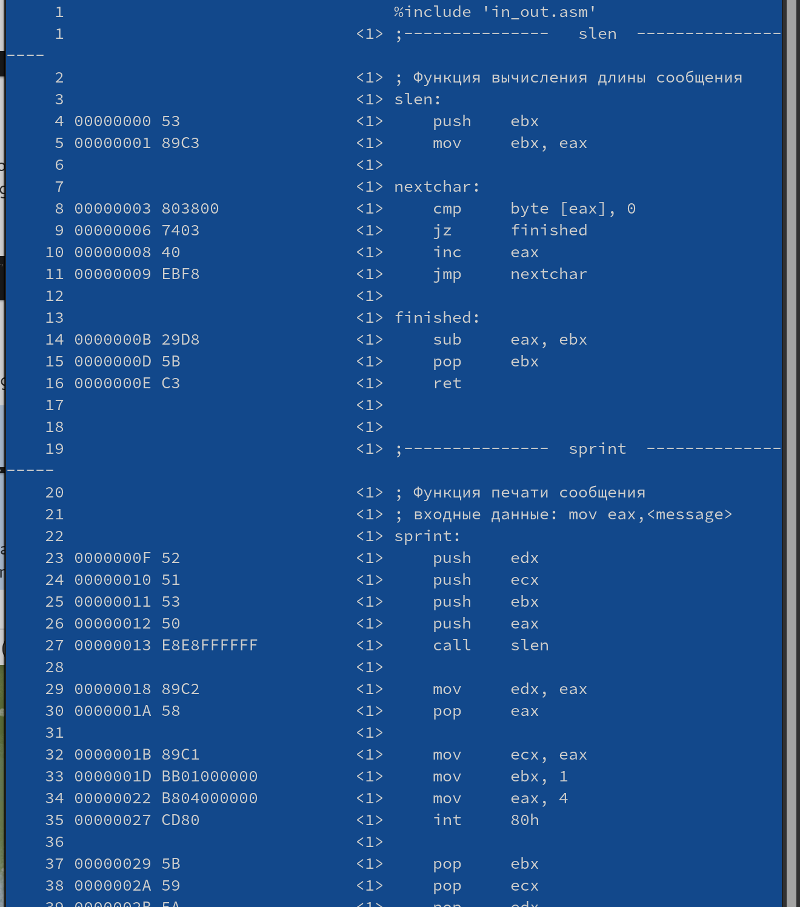{ #fig:013 width=70% }

В данных трёх содержится следующее: (рис. [-@fig:014]).

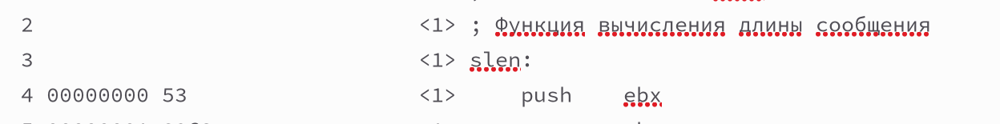{ #fig:014 width=70% }

"2","3","4" -номера строчек.Строчки "2","3" не содержат адреса и машинного кода, т.к. в строке "2" записан коментарий,а в "3" название функции (в строке "4" 00000000-адрес строки, 53  машинный код).

Открываю файл с программой lab7-2.asm и в любой инструкции с двумя операндами
удаляю один операнд. Выполняю трансляцию с получением файла листинга:(рис. [-@fig:015]).

{ #fig:015 width=70% }

В этом случае происходит ошибка трансляции (рис. [-@fig:016]).

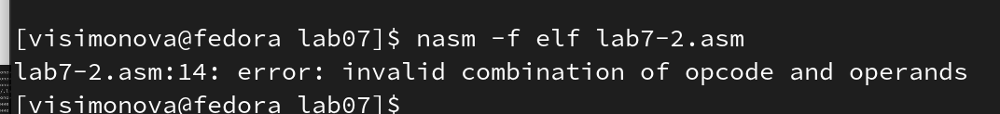{ #fig:016 width=70% }

Я не получаю ни одного файла,так как mov должка содержать два операнда.

## Задание для самостоятельной работы 

**Задание 1**
Создаю файл zadanie1.asm и ввожу в него код для сравнения трёх переменных и вывода наименьшего из них.(Значения переменных выбираю в соответствии с вариантом 13, полученным мной ранее)(рис. [-@fig:017]).

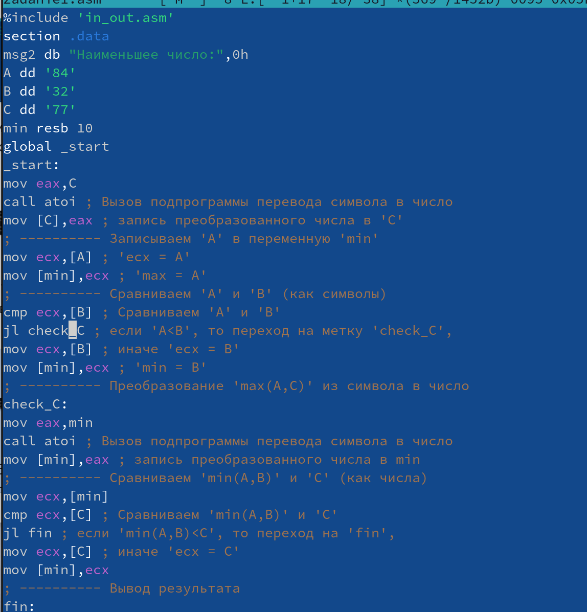{ #fig:017 width=70% }

Создаю и запускаю исполняемый файл,программа вывела наименьшее число из трёх(из 83,32,77 вывела 32) (рис. [-@fig:018]).

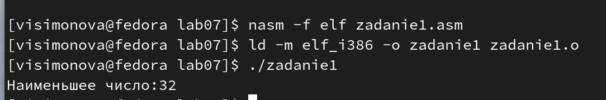{ #fig:018 width=70% }

Код к заданию 1:
```
%include 'in_out.asm'
section .data
msg2 db "Наименьшее число:",0h
A dd '84'
B dd '32'
C dd '77'
section .bss
min resb 10
section .text
global _start
_start:
mov eax,C
call atoi ; Вызов подпрограммы перевода символа в число
mov [C],eax ; запись преобразованного числа в 'C'
; ---------- Записываем 'A' в переменную 'min'
mov ecx,[A] ; 'ecx = A'
mov [min],ecx ; 'max = A'
; ---------- Сравниваем 'A' и 'B' (как символы)
cmp ecx,[B] ; Сравниваем 'A' и 'B'
jl check_C ; если 'A<B', то переход на метку 'check_C',
mov ecx,[B] ; иначе 'ecx = B'
mov [min],ecx ; 'min = B'
; ---------- Преобразование 'max(A,C)' из символа в число
check_C:
mov eax,min
call atoi ; Вызов подпрограммы перевода символа в число
mov [min],eax ; запись преобразованного числа в min
; ---------- Сравниваем 'min(A,B)' и 'C' (как числа)
mov ecx,[min]
cmp ecx,[C] ; Сравниваем 'min(A,B)' и 'C'
jl fin ; если 'min(A,B)<C', то переход на 'fin',
mov ecx,[C] ; иначе 'ecx = C'
mov [min],ecx
; ---------- Вывод результата
fin:
mov eax, msg2
call sprint ; Вывод сообщения 'Наименьшее число: '
mov eax,[min]
call iprintLF ; Вывод 'min(A,B,C)'
call quit ; Выход
```

**Задание 2**

Создаю файл zadanie2.asm и ввожу в него код для программы, которая для введенных с клавиатуры значений x и a вычисляет значение заданной функции f(x)(вариант 13) и выводит результат вычислений.(рис. [-@fig:019]).

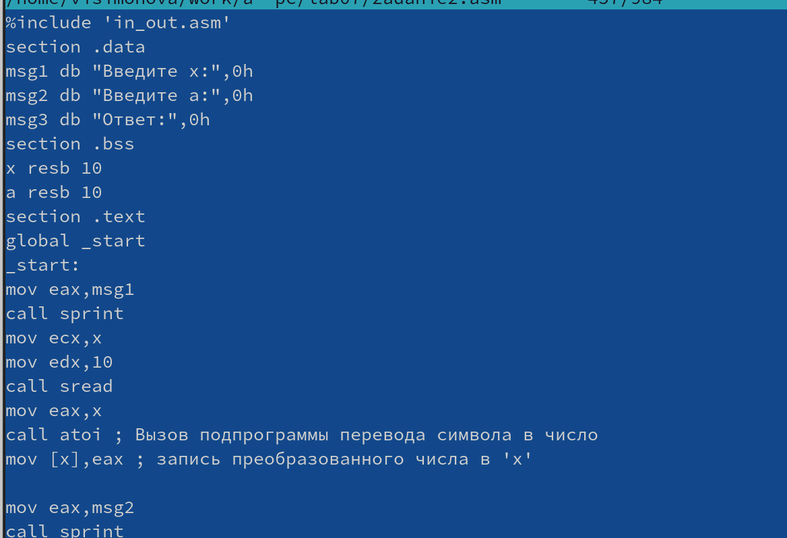{ #fig:019 width=70% }

Создаю и запускаю исполняемый файл, в обоих вариантах введённого числа а программа работает корректно и вычисляет значения для двух соответствующих случаев функции. (рис. [-@fig:020]).

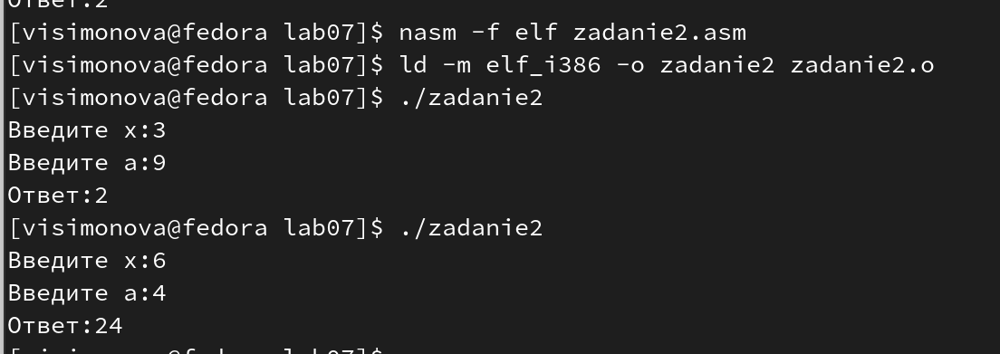{ #fig:020 width=70% }

Код к заданию 2:
```
%include 'in_out.asm'
section .data
msg1 db "Введите x:",0h
msg2 db "Введите a:",0h
msg3 db "Ответ:",0h
section .bss
x resb 10
a resb 10
section .text
global _start
_start:
mov eax,msg1
call sprint
mov ecx,x
mov edx,10
call sread
mov eax,x
call atoi ; Вызов подпрограммы перевода символа в число
mov [x],eax ; запись преобразованного числа в 'x'

mov eax,msg2
call sprint
mov ecx,a
mov edx,10
call sread
; ---------- Преобразование 'a' из символа в число
mov eax,a
call atoi ; Вызов подпрограммы перевода символа в число
mov [a],eax ; запись преобразованного числа в 'a'

mov eax,[a]
cmp eax,7
jl fin
jmp fin1
fin:
mov eax, msg3
call sprint 
mov eax,[a]
mov ebx,[x]
mul ebx
call iprintLF 
call quit ; Выход
fin1:
mov eax,msg3
call sprint
mov eax,[a]
add eax,-7
call iprintLF 
call quit ; Выход
```

# Выводы

Изучила команды условного и безусловного перехода, научилась писать программы с импользованием переходов . Познакомилась со структурой и назначением файла листинга.

# Список литературы{.unnumbered}

::: {#refs}
:::
 [Лабораторная работа №7](https://esystem.rudn.ru/pluginfile.php/2089087/mod_resource/content/0/%D0%9B%D0%B0%D0%B1%D0%BE%D1%80%D0%B0%D1%82%D0%BE%D1%80%D0%BD%D0%B0%D1%8F%20%D1%80%D0%B0%D0%B1%D0%BE%D1%82%D0%B0%20%E2%84%967.%20%D0%9A%D0%BE%D0%BC%D0%B0%D0%BD%D0%B4%D1%8B%20%D0%B1%D0%B5%D0%B7%D1%83%D1%81%D0%BB%D0%BE%D0%B2%D0%BD%D0%BE%D0%B3%D0%BE%20%D0%B8%20%D1%83%D1%81%D0%BB%D0%BE%D0%B2%D0%BD%D0%BE%D0%B3%D0%BE%20%D0%BF%D0%B5%D1%80%D0%B5%D1%85%D0%BE%D0%B4%D0%BE%D0%B2%20%D0%B2%20Nasm.%20%D0%9F%D1%80%D0%BE%D0%B3%D1%80%D0%B0%D0%BC%D0%BC%D0%B8%D1%80%D0%BE%D0%B2%D0%B0%D0%BD%D0%B8%D0%B5%20%D0%B2%D0%B5%D1%82%D0%B2%D0%BB%D0%B5%D0%BD%D0%B8%D0%B9..pdf)
