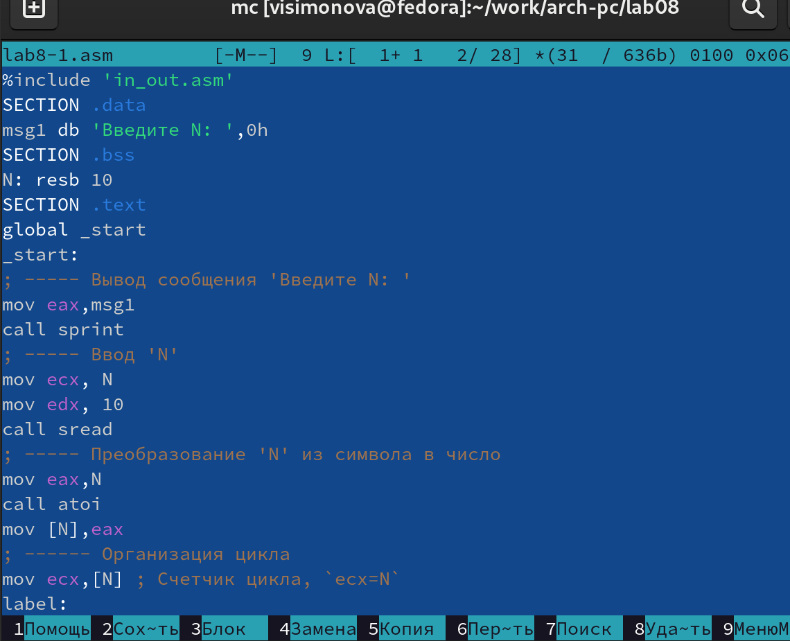

---
## Front matter
title: "Отчёт по лабораторной работе №8"
subtitle: "Дисциплина: архитектура компьютеров"
author: "Симонова Виктория Игоревна"

## Generic otions
lang: ru-RU
toc-title: "Содержание"

## Bibliography
bibliography: bib/cite.bib
csl: pandoc/csl/gost-r-7-0-5-2008-numeric.csl

## Pdf output format
toc: true # Table of contents
toc-depth: 2
lof: true # List of figures
lot: true # List of tables
fontsize: 12pt
linestretch: 1.5
papersize: a4
documentclass: scrreprt
## I18n polyglossia
polyglossia-lang:
  name: russian
  options:
	- spelling=modern
	- babelshorthands=true
polyglossia-otherlangs:
  name: english
## I18n babel
babel-lang: russian
babel-otherlangs: english
## Fonts
mainfont: PT Serif
romanfont: PT Serif
sansfont: PT Sans
monofont: PT Mono
mainfontoptions: Ligatures=TeX
romanfontoptions: Ligatures=TeX
sansfontoptions: Ligatures=TeX,Scale=MatchLowercase
monofontoptions: Scale=MatchLowercase,Scale=0.9
## Biblatex
biblatex: true
biblio-style: "gost-numeric"
biblatexoptions:
  - parentracker=true
  - backend=biber
  - hyperref=auto
  - language=auto
  - autolang=other*
  - citestyle=gost-numeric
## Pandoc-crossref LaTeX customization
figureTitle: "Рис."
tableTitle: "Таблица"
listingTitle: "Листинг"
lofTitle: "Список иллюстраций"
lotTitle: "Список таблиц"
lolTitle: "Листинги"
## Misc options
indent: true
header-includes:
  - \usepackage{indentfirst}
  - \usepackage{float} # keep figures where there are in the text
  - \floatplacement{figure}{H} # keep figures where there are in the text
---

# Цель работы

Приобретение навыков написания программ с использованием циклов и обработкой
аргументов командной строки.

# Задание

1. Реализация циклов в NASM.

2. Обработка аргументов командной строки.

3. Задание для самостоятельной работы.

# Теоретическое введение
## Организация стека

Стек — это структура данных, организованная по принципу LIFO («Last In — First Out»
или «последним пришёл — первым ушёл»). Стек является частью архитектуры процессора и
реализован на аппаратном уровне. Для работы со стеком в процессоре есть специальные
регистры (ss, bp, sp) и команды.
Основной функцией стека является функция сохранения адресов возврата и передачи
аргументов при вызове процедур. Кроме того, в нём выделяется память для локальных
переменных и могут временно храниться значения регистров.
На рис. 8.1 показана схема организации стека в процессоре.
Стек имеет вершину, адрес последнего добавленного элемента, который хранится в регистре esp (указатель стека). Противоположный конец стека называется дном. Значение,
помещённое в стек последним, извлекается первым. При помещении значения в стек указатель стека уменьшается, а при извлечении — увеличивается.
Для стека существует две основные операции:
• добавление элемента в вершину стека (push);
• извлечение элемента из вершины стека (pop).


# Выполнение лабораторной работы

## Реализация циклов в NASM

Создаю каталог lab08 для файлов лабораторной работы и файл lab8-1.asm (рис. [-@fig:001]).

{ #fig:001 width=70% }

Ввожу текст прграммы из листинга в файл (рис. [-@fig:002]).

{ #fig:002 width=70% }

Создаю исполняемый файл и проверяю его работу. (рис. [-@fig:003]).

{ #fig:003 width=70% }

Программа по порядку выводит введённое с клавиатуры значение N, которое каждый раз уменьшается на 1(инструкция loop), число проходов цикла соответсятвует значению N. 

Корректирую текст программы (рис. [-@fig:004]).

{ #fig:004 width=70% }

Создаю исполняемый файл и проверяю его работу. (рис. [-@fig:005]).

{ #fig:005 width=70% }

Число проходов цикла не соответствует введённому значению N (N принимает значения через 1, тк в теле цикла добавлено изменение знаяения регистра ecx).

Изсменяю программу, добавляя команду push(испозуем стек) (рис. [-@fig:006]).

{ #fig:006 width=70% }

Создаю исполняемый файл и проверяю его работу. (рис. [-@fig:007]).

{ #fig:007 width=70% }

Число проходов цикла соответствует введённому значению N и выводит числа от N-1 до 0 включительно.

## Обработка аргументов командной строки

Создаю файл lab8-2.asm (рис. [-@fig:008]).

{ #fig:008 width=70% } 

Ввожу в файл текст программы, которая выводит на экран аргументы командной строки (рис. [-@fig:009]).

{ #fig:009 width=70% } 

Создаю исполняемый файл и проверяю его работу. (рис. [-@fig:010]).

{ #fig:010 width=70% }

Программа обработала 4 аргумента, т.к. цифра "2" не была взята в кавычки вместе со словом "аргумент", в отличие от 'аргумент 3', который программа восприняла как один аргумент.

Создаю файл lab8-3.asm (рис. [-@fig:011]).

{ #fig:011 width=70% } 

Ввожу в файл текст программы, которая выводит на экран сумму чисел, которые введены как аргументы командной строки (рис. [-@fig:012]).

{ #fig:012 width=70% } 

Создаю исполняемый файл и проверяю его работу. (рис. [-@fig:013]).

{ #fig:013 width=70% }

Изменяю программу так, чтобы она вычислла произведеник аргументов,введённых из командной строки (рис. [-@fig:014]).

{ #fig:014 width=70% }

Создаю исполняемый файл и проверяю его работу. (рис. [-@fig:015]).

{ #fig:015 width=70% }

## Задание для самостоятельной работы

Пишу текст программы для вычисления суммы значений функции f(x)=12*x-7 в соответствии с моим номером варианта (13) для x = x1, x2, ..., xn. Значения xi передаются как аргументы (рис. [-@fig:016]).

{ #fig:016 width=70% }

Текст программы:

```
%include 'in_out.asm'
SECTION .data
msg db "Ответ: ",0
SECTION .text
global _start
_start:
pop ecx ; Извлекаем из стека в ecx количество
; аргументов (первое значение в стеке)
pop edx ; Извлекаем из стека в edx имя программы
; (второе значение в стеке)
sub ecx,1 ; Уменьшаем ecx на 1 (количество
; аргументов без названия программы)
mov esi, 0 ; Используем esi для хранения
; промежуточных сумм
next:
cmp ecx,0h ; проверяем, есть ли еще аргументы
jz _end ; если аргументов нет выходим из цикла
; (переход на метку `_end`)
pop eax ; иначе извлекаем следующий аргумент из стека
call atoi ; преобразуем символ в число
mov ebx,12
mul ebx
sub eax,-7
add esi,eax ; добавляем к промежуточной сумме
; след. аргумент esi=esi+eax
loop next ; переход к обработке следующего аргумента
_end:
mov eax, msg ; вывод сообщения "Результат: "
call sprint
mov eax, esi ; записываем сумму в регистр eax
call iprintLF ; печать результата
call quit ; завершение программы
```

Создаю исполняемый файл и проверяю его работу для несколькиз наборов xi. (рис. [-@fig:017]).

{ #fig:017 width=70% }

# Выводы

Приобрела навыки написания программ с использованием циклов и обработкой аргументов командной строки.

# Список литературы{.unnumbered}

::: {#refs}
:::
 [Лабораторная работа №8](https://esystem.rudn.ru/pluginfile.php/2089095/mod_resource/content/0/%D0%9B%D0%B0%D0%B1%D0%BE%D1%80%D0%B0%D1%82%D0%BE%D1%80%D0%BD%D0%B0%D1%8F%20%D1%80%D0%B0%D0%B1%D0%BE%D1%82%D0%B0%20%E2%84%968.%20%D0%9F%D1%80%D0%BE%D0%B3%D1%80%D0%B0%D0%BC%D0%BC%D0%B8%D1%80%D0%BE%D0%B2%D0%B0%D0%BD%D0%B8%D0%B5%20%D1%86%D0%B8%D0%BA%D0%BB%D0%B0.%20%D0%9E%D0%B1%D1%80%D0%B0%D0%B1%D0%BE%D1%82%D0%BA%D0%B0%20%D0%B0%D1%80%D0%B3%D1%83%D0%BC%D0%B5%D0%BD%D1%82%D0%BE%D0%B2%20%D0%BA%D0%BE%D0%BC%D0%B0%D0%BD%D0%B4%D0%BD%D0%BE%D0%B9%20%D1%81%D1%82%D1%80%D0%BE%D0%BA%D0%B8..pdf)
