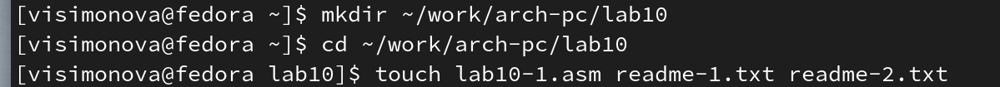
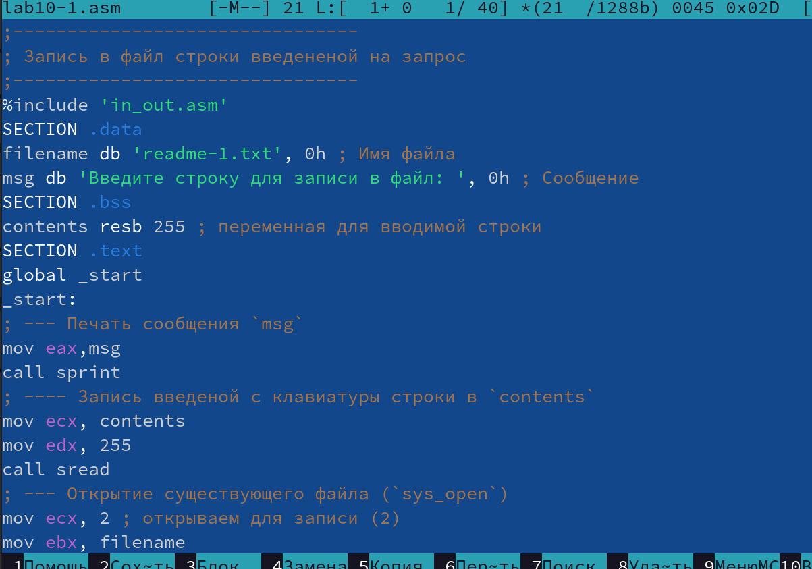
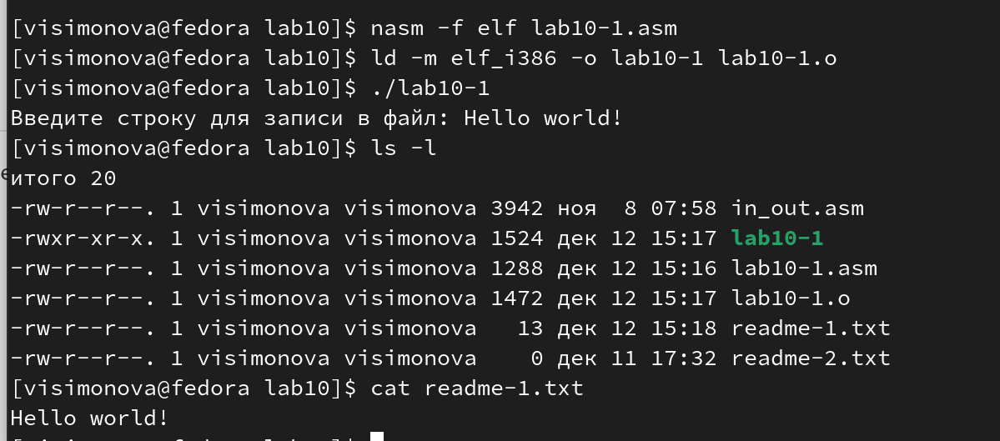
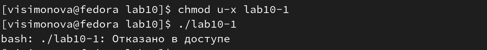
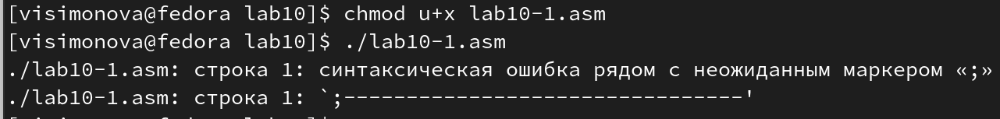
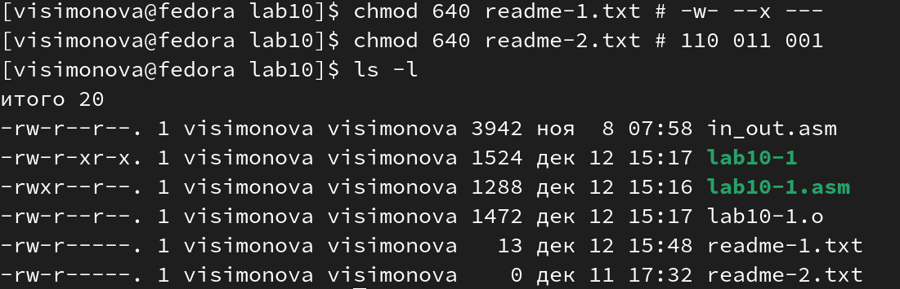
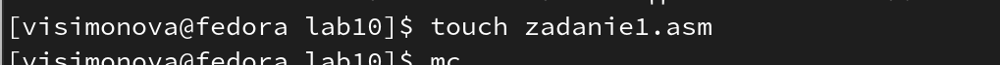
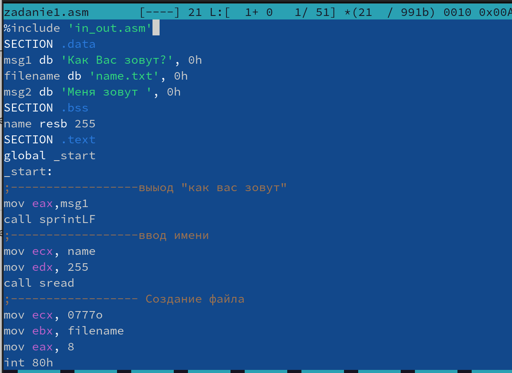

---
## Front matter
title: "Отчёт по лабораторной работе №10"
subtitle: "Дисциплина: архитектура компьютеров"
author: "Симонова Виктория Игоревна"

## Generic otions
lang: ru-RU
toc-title: "Содержание"

## Bibliography
bibliography: bib/cite.bib
csl: pandoc/csl/gost-r-7-0-5-2008-numeric.csl

## Pdf output format
toc: true # Table of contents
toc-depth: 2
lof: true # List of figures
lot: true # List of tables
fontsize: 12pt
linestretch: 1.5
papersize: a4
documentclass: scrreprt
## I18n polyglossia
polyglossia-lang:
  name: russian
  options:
	- spelling=modern
	- babelshorthands=true
polyglossia-otherlangs:
  name: english
## I18n babel
babel-lang: russian
babel-otherlangs: english
## Fonts
mainfont: PT Serif
romanfont: PT Serif
sansfont: PT Sans
monofont: PT Mono
mainfontoptions: Ligatures=TeX
romanfontoptions: Ligatures=TeX
sansfontoptions: Ligatures=TeX,Scale=MatchLowercase
monofontoptions: Scale=MatchLowercase,Scale=0.9
## Biblatex
biblatex: true
biblio-style: "gost-numeric"
biblatexoptions:
  - parentracker=true
  - backend=biber
  - hyperref=auto
  - language=auto
  - autolang=other*
  - citestyle=gost-numeric
## Pandoc-crossref LaTeX customization
figureTitle: "Рис."
tableTitle: "Таблица"
listingTitle: "Листинг"
lofTitle: "Список иллюстраций"
lotTitle: "Список таблиц"
lolTitle: "Листинги"
## Misc options
indent: true
header-includes:
  - \usepackage{indentfirst}
  - \usepackage{float} # keep figures where there are in the text
  - \floatplacement{figure}{H} # keep figures where there are in the text
---

# Цель работы

Приобретение навыков написания программ для работы с файлами

# Задание

1. Написание программ для работы с файлами.

2. Задание для самостоятельной работы.

# Теоретическое введение
## Права доступа к файлам

ОС GNU/Linux является многопользовательской операционной системой. И для обеспечения защиты данных одного пользователя от действий других пользователей существуют
специальные механизмы разграничения доступа к файлам. Кроме ограничения доступа, данный механизм позволяет разрешить другим пользователям доступ данным для совместной
работы.
Права доступа определяют набор действий (чтение, запись, выполнение), разрешённых
для выполнения пользователям системы над файлами. Для каждого файла пользователь
может входить в одну из трех групп: владелец, член группы владельца, все остальные. Для
каждой из этих групп может быть установлен свой набор прав доступа. Владельцем файла
является его создатель. Для предоставления прав доступа другому пользователю или другой
группе командой
chown [ключи] <новый_пользователь>[:новая_группа] <файл>
или
chgrp [ключи] < новая_группа > <файл>
Набор прав доступа задается тройками битов и состоит из прав на чтение, запись и исполнение файла. В символьном представлении он имеет вид строк rwx, где вместо любого
символа может стоять дефис. Всего возможно 8 комбинаций, приведенных в таблице 10.1.
Буква означает наличие права (установлен в единицу второй бит триады r — чтение, первый
бит w — запись, нулевой бит х — исполнение), а дефис означает отсутствие права (нулевое
значение соответствующего бита). Также права доступа могут быть представлены как восьмеричное число. Так, права доступа rw- (чтение и запись, без исполнения) понимаются как
три двоичные цифры 110 или как восьмеричная цифра 6.
## Работа с файлами средствами Nasm

В операционной системе Linux существуют различные методы управления файлами, например, такие как создание и открытие файла, только для чтения или для чтения и записи, добавления в существующий файл, закрытия и удаления файла, предоставление прав доступа.
Обработка файлов в операционной системе Linux осуществляется за счет использования
определенных системных вызовов. Для корректной работы и доступа к файлу при его открытии или создании, файлу присваивается уникальный номер (16-битное целое число) –дескриптор файла.
Общий алгоритм работы с системными вызовами в Nasm можно представить в следующем
виде:
1. Поместить номер системного вызова в регистр EAX;
2. Поместить аргументы системного вызова в регистрах EBX, ECX и EDX;
3. Вызов прерывания (int 80h);
4. Результат обычно возвращается в регистр EAX.

# Выполнение лабораторной работы

Создаю каталог для программам лабораторной работы № 10, перехожу в него и создаю файлы lab10-1.asm, readme-1.txt и readme-2.txt (рис. [-@fig:001]).

{ #fig:001 width=70% }

Ввожу в файл lab10-1.asm текст программы из листинга 10.1 (Программа записи в
файл сообщения) (рис. [-@fig:002]).

{ #fig:002 width=70% }

Создаю исполняемый файл и проверяю его работу и выполняю инструкции (рис. [-@fig:003]).

{ #fig:003 width=70% }

С помощью команды chmod изменяю права доступа к исполняемому файлу lab10-1, запретив его выполнение, затем пытаюсь выполнить файл (рис. [-@fig:004]).

{ #fig:004 width=70% }

Исполнить файл не получается, т.к. была введена инструкция chmod с аргументами "u" Владелец, "-" Отменить набор прав, "x" Право на исполнение, таким образом я заюрала у файла права на исполнение, поэтому файл и не исполняется.

С помощью команды chmod изменяю права доступа к файлу lab10-1.asm с исходным текстом программы, добавив права на исполнение. Пытаюсь выполнить его(рис. [-@fig:005]).

{ #fig:005 width=70% }

Файл не исполняется, т.к. не содержит в себе команд для терминала.

В соответствии с вариантом в таблице 10.4 (мой вариант - 13) предоставляю права доступа к файлу readme-1.txt ,представленные в символьном виде, а для файла readme-2.txt – в двочном виде. Проверяю правильность выполнения с помощью команды ls -l. (рис. [-@fig:006]).

{ #fig:006 width=70% }

## Задание для самостоятельной работы

Пишу программу работающую по следующему алгоритму:
• Вывод приглашения “Как Вас зовут?”
• ввести с клавиатуры свои фамилию и имя
• создать файл с именем name.txt
• записать в файл сообщение “Меня зовут”
• дописать в файл строку введенную с клавиатуры
• закрыть файл

Создаю файл для выполнения индивидуального задания (рис. [-@fig:007]).

{ #fig:007 width=70% }

Ввожу код программы в файл (рис. [-@fig:008]).

{ #fig:008 width=70% }

Создаю исполняемый файл и проверяю его работу. Проверяю наличие файла и его
содержимое с помощью команд ls и cat.(рис. [-@fig:009]).

{ #fig:009 width=70% }

Код программы:

```
%include 'in_out.asm'
SECTION .data
msg1 db 'Как Вас зовут?', 0h
filename db 'name.txt', 0h
msg2 db 'Меня зовут ', 0h
SECTION .bss
name resb 255
SECTION .text
global _start
_start:
;------------------выыод "как вас зовут"
mov eax,msg1
call sprintLF
;------------------ввод имени
mov ecx, name
mov edx, 255
call sread
;------------------ Создание файла
mov ecx, 0777o
mov ebx, filename
mov eax, 8
int 80h
;--------------------открытие файла
mov ecx, 2
mov ebx, filename
mov eax, 5
int 80h
; --- Запись дескриптора файла в `esi`
mov esi, eax
; --- Расчет длины введенной строки
mov eax, msg2
call slen
; --- Записываем в файл
mov edx, eax
mov ecx, msg2
mov ebx, esi
mov eax, 4
int 80h
mov eax, name
call slen
mov edx, eax
mov ecx, name
mov ebx, esi
mov eax, 4
int 80h
; --- Закрываем файл (`sys_close`)
mov ebx, esi
mov eax, 6
int 80h
call quit

```

# Выводы

Приобрела навыки написания программ для работы с файлами, разобралась в правах доступа к файлам.

# Список литературы{.unnumbered}

::: {#refs}
:::
1. GDB: The GNU Project Debugger. — URL: https://www.gnu.org/software/gdb/.
2. GNU Bash Manual. — 2016. — URL: https://www.gnu.org/software/bash/manual/.
3. Midnight Commander Development Center. — 2021. — URL: https://midnight-commander.
org/.
4. NASM Assembly Language Tutorials. — 2021. — URL: https://asmtutor.com/.
5. Newham C. Learning the bash Shell: Unix Shell Programming. — O’Reilly Media, 2005. —
354 с. — (In a Nutshell). — ISBN 0596009658. — URL: http://www.amazon.com/Learningbash-Shell-Programming-Nutshell/dp/0596009658.
6. Robbins A. Bash Pocket Reference. — O’Reilly Media, 2016. — 156 с. — ISBN 978-1491941591.
7. The NASM documentation. — 2021. — URL: https://www.nasm.us/docs.php.
8. Zarrelli G. Mastering Bash. — Packt Publishing, 2017. — 502 с. — ISBN 9781784396879.
9. Колдаев В. Д., Лупин С. А. Архитектура ЭВМ. — М. : Форум, 2018.
10. Куляс О. Л., Никитин К. А. Курс программирования на ASSEMBLER. — М. : Солон-Пресс,
2017.
11. Новожилов О. П. Архитектура ЭВМ и систем. — М. : Юрайт, 2016.
12. Расширенный ассемблер: NASM. — 2021. — URL: https://www.opennet.ru/docs/RUS/nasm/.
13. Робачевский А., Немнюгин С., Стесик О. Операционная система UNIX. — 2-е изд. — БХВПетербург, 2010. — 656 с. — ISBN 978-5-94157-538-1.
14. Столяров А. Программирование на языке ассемблера NASM для ОС Unix. — 2-е изд. —
М. : МАКС Пресс, 2011. — URL: http://www.stolyarov.info/books/asm_unix.
15. Таненбаум Э. Архитектура компьютера. — 6-е изд. — СПб. : Питер, 2013. — 874 с. —
(Классика Computer Science).
16. Таненбаум Э., Бос Х. Современные операционные системы. — 4-е изд. — СПб. : Питер,
2015. — 1120 с. — (Классика Computer Science).
